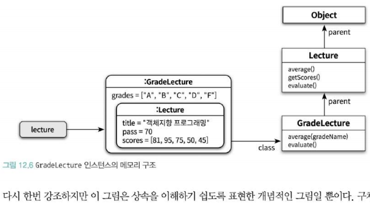

# 다형성

하나의 추상 인터페이스에 대해 코드를 작성하고 이 추상 인터페이스에 대해 서로 다른 구현을 연결할 수 있는 능력으로 정의한다.

객체지향 프로그래밍에서 사용되는 다형성

- 유니버설 다형성
    - 매개변수 - 제네릭 프로그래밍과 관련이 높다. 매개변수 타입을 사용하는 시점에 구체타입으로 지정하는 방식
    - 포함 - 메세지가 동일하더라도 수신한 객체의 타입에 따라 수행되는 행동이 달라지는 능력
- 임시 다형성
    - 오버로딩 - 하나의 클래스 안에 동일한 이름의 메서드 존재
    - 강제 - 언어가 지원하는 자동적인 타입변환이나 사용자가 직접 구현한 타입변환을 통해 동일한 연산자를 다양하게 사용하는 방식

일반적으로 다형성을 얘기할 때는 포함 다형성을 뜻한다.

포함 다형성 (서브타입 다형성)을 구현하는 가장 일반적인 방법은 상속을 사용하는 것이다.

상속의 진정한 목적은 코드의 재사용이 아니라 다형성을 위한 서브타입 계층을 구축하는 것이다.

## 상속의 양면성

상속은 다형성을 가능하게 하는 타입 계층을 구축하기 위한 것이다. 코드를 재사용하기 위해서 상속을 사용하면 유지보수하기 버거운 코드가 만들어질 확률이 높다.

## 상속 사용

상속을 사용해 특정 필드가 추가된 자식클래스를 생성한다.

데이터 관점에서 상속은 자식 클래스의 인스턴스 안에 부모 클래스의 인스턴스를 포함하는 것으로 볼 수 있따.

## 행동 관점의 상속

행동 관점의 상속은 부모 클래스가 정의한 일부 메서드를 자식 클래스의 메서드로 포함시키는 것을 의미한다.



## 같은 메시지, 다른 메서드

업캐스팅과 동적 바인딩

- 부모 클래스 타입으로 선언된 변수에 자식 클래스의 인스턴스를 할당하는 것이 가능하다. 이를 업캐스팅이라고 부른다.
- 선언된 변수 타입이 아니라 메시지를 수신하는 객체의 타입에 따라 실행되는 메서드가 결정된다. 컴파일 시점에 결정하기 때문에 가능하다. 이를 동적바인딩이라 부른다.

# 동적 메서드 탐색과 다형성

객체지향 시스템은 다음 규칙에 따라 실행할 메서드르 선택한다.

- 메시지를 수신한 객체는 먼저 자신을 생성한 클래스에 적합한 메서드가 존재하는지 검사한다. 존재하면 메서드를 실행하고 탐색을 종료한다.
- 메서드를 차지 못했다면 부모 클래스에서 메서드 탐색을 계속한다. 이 과정은 적합한 메서드를 찾을 때까지 상속 계층을 따라 올라가며 계속된다.
- 상속 계층의 가장 최상위 클래스에 이르러씾만 메서드를 발견하지 못한 경우 예외를 발생시키며 탐색을 종료한다.

self 참조라는 임시 변수를 자동으로 생성한 후 메시지를 수신한 객체를 가리키도록 설정한다. 상속계층의 역방향으로 이루어지며 탐색이 종료되는 순간 self 참조는 자동으로 소멸된다.

```java
Lecture lecture = new GradeLecture();
lecture.average();
```

동적 메서드 탐색은 메시지를 수신한 객체의 클래스인 GradeLecture에서 시작한다.

## 동적인 문맥

자신에게 다시 메시지를 전송하는 self 전송이 있다면 어떤 메서드가 실행될지 예상하기 어렵다.

메서드 안에서 다른 메서드가 실행된다면 해당 클래스 계층이 아닌 self 가 참조하는 클래스 계층부터 다시 탐색을 시작한다.

super 전송은 부모 클래스에서부터 메서드 탐색을 시작하게 된다.

# 상속 대 위임

동일한 객체 잠조에게 동일한 메시지를 전송하더라도, self 참조가 가리키는 객체의 클래스가 무엇이냐에 따라 메서드 탐색을 위한 문맥이 달라진다.