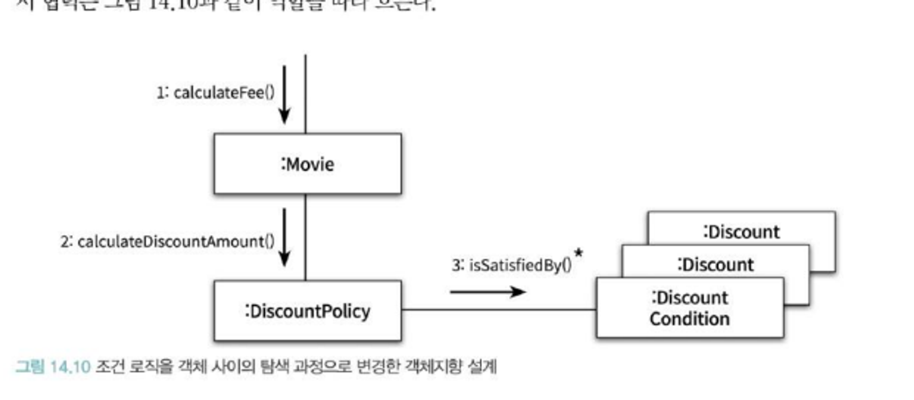
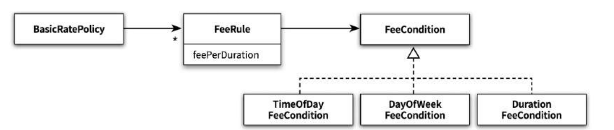

# 일관성 있는 협력

객체지향 패러다임의 장점은 설계를 재사용할 수 있다는 것이다.

일관성 있는 협력을 통해, 이해와 확장이 쉬워진다.

BasicRatePolicy

ㄴ FixedFeePolicy

ㄴ TimeOfDayDiscountPolicy

ㄴ DayOfWeekDiscountPolicy

ㄴ DurationDiscountPolicy

TimeOfDayDiscountPolicy → Call → DateTimeInterval

## TimeOfDayDiscountPolicy

```java
public class TimeOfDayDiscountPolicy extends BasicRatePolicy {
    private List<LocalTime> starts = new ArrayList<LocalTime>();
    private List<LocalTime> ends = new ArrayList<LocalTime>();
    private List<Duration> durations = new ArrayList<Duration>();
    private List<Money>  amounts = new ArrayList<Money>();

		@Override
    protected Money calculateCallFee(Call call) {
        Money result = Money.ZERO;
        for(DateTimeInterval interval : call.splitByDay()) {
            for(int loop=0; loop < starts.size(); loop++) {
                result.plus(amounts.get(loop).times(Duration.between(from(interval, starts.get(loop)),
                        to(interval, ends.get(loop))).getSeconds() / durations.get(loop).getSeconds()));
            }
        }
        return result;
    }
}
```

- Call

```java
public class Call {
	private DateTimeInterval interval;

	...

	public List<DateTimeInterval> splitByDay() {
			return interval.splitByDay();
	}
}
```

- DateTimeInterval

```java
public class DateTimeInterval {
    private LocalDateTime from;
    private LocalDateTime to;
		...

	public List<DateTimeInterval> splitByDay() {
        if (days() > 0) {
            return split(days());
        }
	
        return Arrays.asList(this);
    }

    private long days() {
        return Duration.between(from.toLocalDate().atStartOfDay(), to.toLocalDate().atStartOfDay()).toDays();
    }

    private List<DateTimeInterval> split(long days) {
        List<DateTimeInterval> result = new ArrayList<>();
        addFirstDay(result);
        addMiddleDays(result, days);
        addLastDay(result);
        return result;
    }
}
```

## DayOfWeekDiscountPolicy

```java
public class DayOfWeekDiscountRule {
    private List<DayOfWeek> dayOfWeeks = new ArrayList<>();
    private Duration duration = Duration.ZERO;
    private Money amount = Money.ZERO;

    public DayOfWeekDiscountRule(List<DayOfWeek> dayOfWeeks,
                                 Duration duration, Money  amount) {
        this.dayOfWeeks = dayOfWeeks;
        this.duration = duration;
        this.amount = amount;
    }

    public Money calculate(DateTimeInterval interval) {
        if (dayOfWeeks.contains(interval.getFrom().getDayOfWeek())) {
            return amount.times(interval.duration().getSeconds() / duration.getSeconds());
        }

        return Money.ZERO;
    }
}
```

클래스들이 기본 정책을 구현한다는 공통 목적을 공유하며 유사한 문제를 해결하고 있지만 설계에 일관성이 없다.

문제점

1. 새로운 구현을 추가할 때, 일관성이 점점 더 어긋나게 된다.
2. 유사한 요구사항을 구현하는 코드지만 다르게 동작한다면 이해하기 어려워 진다.

## DurationDiscountPolicy

```java
public class DurationDiscountRule extends FixedFeePolicy {
    private Duration from;
    private Duration to;

    public DurationDiscountRule(Duration from, Duration to, Money amount, Duration seconds) {
        super(amount, seconds);
        this.from = from;
        this.to = to;
    }

	public Money calculate(Call call) {
        if (call.getDuration().compareTo(to) > 0) {
            return Money.ZERO;
        }

        if (call.getDuration().compareTo(from) < 0) {
            return Money.ZERO;
        }

        // 부모 클래스의 calculateFee(phone)은 Phone 클래스를 파라미터로 받는다.
        // calculateFee(phone)을 재사용하기 위해 데이터를 전달할 용도로 임시 Phone을 만든다.
        Phone phone = new Phone(null);
        phone.call(new Call(call.getFrom().plus(from),
                            call.getDuration().compareTo(to) > 0 ? call.getFrom().plus(to) : call.getTo()));

        return super.calculateFee(phone);
    }
}
```

코드의 재사용을 위해 FixedFeePolicy 클래스를 상속해서 사용한다.

# 일관성 부여하기

일관성 있는 설계를 만들기 위한 방법

1. 다양한 설계 경험을 익히는 것이다.
2. 널리 알려진 디자인 패턴을 학습하고 변경이라는 문맥 안에서 디자인 패턴을 적용하는 것이다.
3. 변하는 개념을 변하지 않는 개념으로부터 분리하는 것이다.
4. 변하는 개념을 캡슐화하는 것이다.

기존 예약 시스템 → if + else if , switch

할인 조건의 종류를 결정하는 부분과 할인 정책을 결정하는 부분이 같이 있기 때문에 변경 주기가 서로 다른 코드가 한 클래스 안에 뭉쳐있게 된다.

새로운 할인 정책이나 할인 조건을 추가하기 위해서는 기존 코드의 내부를 수정해야 하ㄹ기 때문에 오류가 발생할 확률이 높아진다.

객체지향 설계로 할인 정책 종류를 체크하던 조건문을 dicountPolicy로 이동시키면 된다.

movie.getType → movie.calculateMovieFee()



## 일관성 있는 기본 정책 구현하기

## TimeOfDayDiscountPolicy

| 적용 조건 | 단위요금 |  |
| --- | --- | --- |
| 00시 ~ 19시 | 10초당 18원 | → 규칙 |
| 19시 ~ 24시 | 10초당 10원 | → 규칙 |

## DayOfWeekDiscountPolicy

| 적용 조건 | 단위요금 |  |
| --- | --- | --- |
| 특정 요일 | 10초당 10원 | → 규칙 |
| 특정 요일 제외 | 10초당 20원 | → 규칙 |

## DurationDiscountPolicy

| 적용 조건 | 단위요금 |  |
| --- | --- | --- |
| 초기 1분 동안 | 10초당 18원 | → 규칙 |
| 초기 1분 이후 | 10초당 20원 | → 규칙 |

변하는 것과 변하지 않는 부분을 분리하자.

변하는 적용 조건과 변하지 않는 규칙을 분리해야한다.

변하지 않는 부분이 오직 이 추상화에만 의존하도록 관계를 제한하면 변경을 캡슐화할 수 있게된다.



```java
public interface FeeCondition {
    List<DateTimeInterval> findTimeIntervals(Call call);
}
```

→ 각 규칙에 맞게 기간을 쪼개는 findTimeIntervals

규칙에 맞게 쪼개진 기간에 맞는 요금을 계산하는 FeeRule

```java
public class FeeRule {
    private FeeCondition feeCondition;
    private FeePerDuration feePerDuration;

    public FeeRule(FeeCondition feeCondition, FeePerDuration feePerDuration) {
        this.feeCondition = feeCondition;
        this.feePerDuration = feePerDuration;
    }

    public Money calculateFee(Call call) {
        return feeCondition.findTimeIntervals(call)
                .stream()
                .map(each -> feePerDuration.calculate(each))
                .reduce(Money.ZERO, (first, second) -> first.plus(second));
    }
}
```