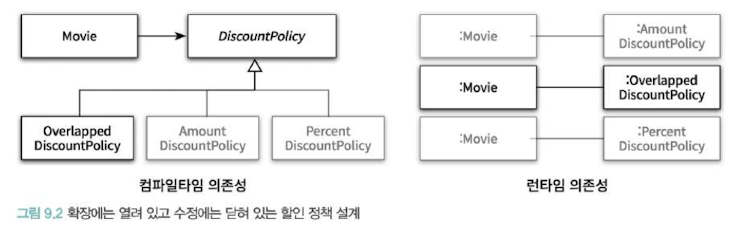
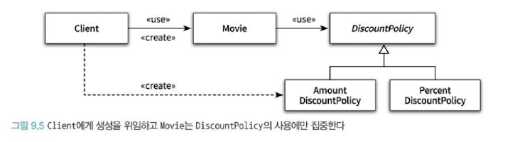

# 유연한 설계

## 개방-폐쇄 원칙 (Open-Closed Principle, OCP)

- 소프트웨어 개체(클래스, 모듈, 함수 등등)는 **확장**에 대해 열려 있어야 하고, **수정**에 대해서는 닫혀 있어야 한다.
  - 확장에 대해 열려 있다: 애플리케이션의 요구사항이 변경될 때 이 변경에 맞게 새로운 **동작**을 추가해서 애플리케이션의 기능을 확장할 수 있음
  - 수정에 대해 닫혀 있다: 기존의 **코드**를 수정하지 않고도 애플리케이션의 동작을 추가하거나 변경할 수 있다.

> 유현한 설계는 기존의 코드를 수정하지 않고도 애플리케이션의 동작을 확장할 수 있는 설계

### 컴파일타임 의존성을 고정시키고 런타임 의존성을 변경

- 런타임 의존성은 실행 시에 협력에 참여하는 객체들 사이의 관계
- 컴파일타임 의존성은 코드에서 드러나는 클래스들 사이의 관계
- 8장에서 컴파일타임에는 DiscountPolicy에만 의존하지만 실제 객체에선 AmountDiscountPolicy, PercentDiscountPolicy를 쓰며 나아가선 OverlappedDiscountPolicy라는 새로운 클래스를 만들어 런타임 객체로 넣어주었다. 이처럼 새로운 클래스를 추가하여도 수정이 일어나지 않는 **닫혀있는 상태**를 볼 수 있음


### 추상화가 핵심

- 개방-폐쇄 원칙의 핵심은 추상화에 의존
- 추상화: 핵심적인 부분만 남기고 불필요한 부분은 생략함으로써 복잡성을 극복하는 기법. 
  - 이 과정을 거치면 문맥이 바뀌어도 변하지 않는 부분만 남게 되고 문맥에 따라 변하는 부분은 생략됨
  - 생략된 부분은 문맥에 적합한 내용으로 채워넣음으로 각 문맥에 적합하게 기능을 구체화하고 확장할 수 있음

```java
public abstract class DiscountPolicy {
    private List<DiscountCondition> conditions = new ArrayList<>();

    public DiscountPolicy(DiscountCondition... conditions) {
        this.conditions = Arrays.asList(condition);
    }

    public Money calculateDiscountAmount(Screening screening) {
        for (DiscountCondition each: conditions) {
            if (each.isSatisfiedBy(screening)) {
                return getDiscountAmount(screening);
            }
        }
        return screening.getMovieFee();
    }

    abstract protected Money getDiscountAmount(Screening screening);
}
```

- 위 코드에서 변하지 않는 부분은 할인 여부 판단하는 로직이고, 변하는 부분은 할인된 요금을 계산하는 방법임. (**getDiscountAmount**) 
- 이렇게 추상화하고 생략된 부분을 추후 구체화하면 OCP를 지킬 수 있음
- 수정에 대한 영향을 최소하하기 위해선 모든 요소가 추상화에 의존해야 한다.
- 아래 Movie와 같이 추상화에만 의존해야 DiscountPolicy의 자식 클래스를 추가하더라도 영향을 받지 않음

```java
public class Movie {
    private DiscountPolicy discountPolicy;

    public Movie(String title, Duration runningTime, Money fee, DiscountPolicy discountPolicy) {
        this.discountPolicy = discountPolicy;
    }

    public Money calculateMovieFee(Screening screening) {
        return fee.minus(discountPolicy.calculateDiscountAmount(screening));
    }
}
```

> 변하는 것과 변하지 않는 것이 무엇인지를 이해하고 이를 추상화의 목적으로 삼아야만 함!

## 생성 사용 분리 (seperating use from creation)

- 아래와 같이 생성자 영역에 구현체를 들이다면 다른 구현체로 바꾸고 싶을 때 코드를 수정해야 하고 이는 OCP 원칙을 위반하게 된다.
- 알아야 하는 지식이 많아지면 결합도도 높아지는데, 특히 **객체 생성 시** 과도하게 높아질 수 있다.
- 물론 객체 생성은 불가피하기에 어디선가 객체 생성은 필요하다. **문제는 부적절한 곳에서 생성하여 발생!**

```java
public class Movie {
    private DiscountPolicy discountPolicy;

    public Movie(String title, Duration runningTime, Money fee) {
        this.discountPolicy = new AmountDiscountPolicy;
    }

    public Money calculateMovieFee(Screening screening) {
        return fee.minus(discountPolicy.calculateDiscountAmount(screening));
    }
}
```

- 유연하고 재사용 가능한 설계를 위해선 두 가지 책임을 서로 다른 객체로 분리해야함
  1. 객체를 생성하는 것
  2. 객체를 사용하는 것
- 사용으로부터 생성을 분리하는 가장 보편적인 방법은 객체를 생성할 책임을 클라이언트로 옮기는 것
- 클라이언트에 컨텍스트에 대한 지식을 옮김으로써 독립적으로 바꿀 수 있음

```java
public class Client {
    public Money getAvatarFee() {
        Movie avatar = new Movie("아바타",
                                    Duration.ofMinutes(120),
                                    Money.wons(10000),
                                    new AmountDiscountPolicy(...));
        return avatar.getFee();
    }
}
```



## 의존성 주입 (Dependency Injection)

- 외부의 독립적인 객체가 인스턴스를 생성한 후 이를 전달해서 의존성을 해결하는 방법을 **의존성 주입**이라고 함
  - **생성자 주입(constructor injection)**: 객체를 생성하는 시점에 생성자를 통한 의존성 해결
  - **setter 주입(setter injection)**: 객체 생성 후 setter 메서드를 통한 의존성 해결
  - **메서드 주입(method injection)**: 메서드 실행 시 인자를 이용한 의존성 해결
- setter 주입의 장점은 의존성의 대상을 런타임에 변경할 수 있지만, 객체가 올바르게 생성되기 위해 어떤 의존성이 필수적인지 명시적으로 표현할 수 없음.
  - 객체가 생성된 후에 호출돼야기 때문에 누락하면 객체는 비정상적인 상태로 생성됨
 
### 숨겨진 의존성은 나쁘다

- **SERVICE LOCATOR**는 의존성을 해결할 객체들을 보관하는 일종의 저장소이며, 객체가 직접 SERVICE LOCATOR에게 의존성을 해결해줄 것을 요청함
- 아래처럼 작성해두면 Movie의 할인 타입은 전역적으로 처리할 수 있다.

```java
public class Movie {
    private DiscountPolicy discountPolicy;

    public Movie(String title, Duration runningTime, Money fee) {
        this.tile = title;
        this.runningTime = runningTime;
        this.fee = fee;
        this.discountPolicy = ServiceLocator.discountPolicy();
    }
}

public class ServiceLocator {
    private static ServiceLocator soleInstance = new ServiceLocator();
    private DiscountPolicy discountPolicy;

    public static DiscountPolicy discountPolicy() {
        return soleInstance.discountPolicy;
    }

    public static void provide(DiscountPolicy discountPolicy) {
        soleInstance.discountPolicy = discountPolicy;
    }

    private ServiceLocator() {
    }
}

// 할당
ServiceLocator.provide(new AmountDiscountPolicy());
Movie avatar = new Movie("아바타", Duration.ofMinutes(120), Money.wons(10000));
```

- 하지만 이 패턴을 사용하면 의존성을 감추게 된다. Movi는 DiscountPolicy에 의존하지만, 퍼블릭 인터페이스 어디에도 이 의존성에 대한 정보가 보이지 않음 **(//할당 생성자 부분)**
- 만약 ServiceLocator.provide(new AmountDiscountPolicy()); 이 부분을 누락하고 선언하면 NullPointerException이 발생할 것이고, 컴파일 타임이 아닌 런타임때서야 발견하는 등의 찾는데 어려움을 겪을 수 있다. 이는 디버깅을 어렵게 만든다.
- 또한, 계속 동일한 상태를 공유하게 됨으로써, 서로 고립돼야 한다는 단위 테스트의 기본 원칙에 위반하게 된다.
- 숨겨진 의존성이 가지는 가장 큰 문제점은 의존성을 이해하기 위해 코드의 내부 구현을 이해할 것을 강요하게 되는 것이다. 이는 곧 **캡슐화를 위반**하게 된다.

> 명시적인 의존성이 숨겨진 의존성보다 좋다. 가급적 의존성을 객체의 퍼블릭 인터페이스에 노출하라.
