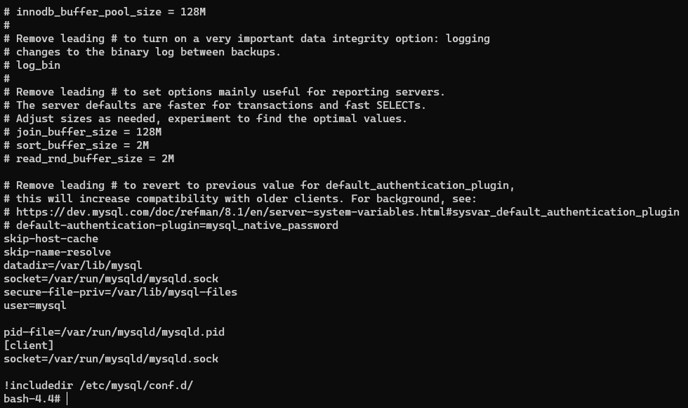

# 아키텍처

## 4.1 MySQL 엔진 아키텍처

### MySQL 엔진

- 클라이언트로부터의 접속 및 쿼리 요청을 처리하는 커넥션 핸들러와 SQL 파서 및 전처리기, 쿼리의 최적화된 실행을 위한 옵티마이저가 중심을 이룸
- 표준 SQL(ANSI SQL) 문법을 지원하기 때문에 표준 문법에 따라 작성된 쿼리는 타 DBMS와 호환되어 실행될 수 있음

### 스토리지 엔진

- 실제 데이터를 디스크 스토리지에 저장하거나 디스크 스토리지로부터 데이터를 읽어오는 역할
- MySQL 엔진은 하나지만 스토리지 엔진은 여러 개를 동시에 사용할 수 있음 (MyISAM - 캐시, InnoDB - 버퍼 풀)

### 핸들러 API

- MySQL 엔진의 쿼리 실행기에서 데이터를 쓰거나 읽어야 할 때 각 스토리지 엔진에 쓰기 또는 읽기 요청함. 이런 요청을 핸들러(Handler)라 한다.

## 4.1.2 MySQL 스레딩 구조

- MySQL 서버는 프로세스 기반이 아니라 스레드 기반으로 작동하며, 크게 포그라운드(Foreground) 스레드와 백그라운드(Background) 스레드로 구분할 수 있음

> SELECT thread_id, name, type, processlist_user, processlist_host FROM performance_schema.threads ORDER BY type, thread_id;

1. 스프링 thread pool로 인한 연결

2. 스프링 종료 후 connection 종료 후


### 포그라운드 스레드 (클라이언트 스레드)

- 최소한 MySQL 서버에 접속된 클라이언트의 수만큼 존재하며, 주로 각 클라이언트 사용자가 요청하는 쿼리 문장을 처리함
- 클라이언트 사용자가 작업을 마치고 커넥션을 종료하면 해당 커넥션을 담당하던 스레드는 다시 스레드 캐시(Thread cache)로 되돌아감
- 이때 이미 스레드 캐시에 일정 개수 이상의 대기 중인 스레드가 있으면 스레드 캐시에 넣지 않고 스레드를 종료시켜 일정 개수의 스레드만 캐시에 존재하게 됨
- 최대 스레드 개수는 thread_cache_size 시스템 변수로 설정
- 포그라운드 스레드는 데이터를 MySQL의 데이터 버퍼나 캐시로부터 가져오며, 버퍼나 캐시에 없는 경우엔 직접 디스크의 데이터나 인덱스 파일로부터 데이터를 읽어와서 작업을 처리함

### 백그라운드 스레드

- InnoDB에서 다음과 같은 작업이 백그라운드로 처리됨
  - 인서트 버퍼(Insert Buffer)를 병합하는 스레드
  - 로그를 디스크로 기록하는 스레드
  - InnoDB 버퍼 풀의 데이터를 디스크에 기록하는 스레드
  - 데이터를 버퍼로 읽어 오는 스레드
  - 잠금이나 데드락을 모니터링하는 스레드

### 메모리 할당 및 사용 구조

- MySQL에 사용되는 메모리 공간은 크게 글로벌 메모리 영역과 로컬 메모리 영역으로 구분 됨
- 글로벌 메모리 영역의 모든 메모리 공간은 MySQL 서버가 시작되면서 운영체제로부터 할당 됨
- 글로벌 메모리 영역과 메모리 영역은 MySQL 서버 내에 존재하는 많은 스레드가 공유해서 사용하는 공간인지 여부에 따라 구분됨
- 글로벌 메모리 영역
  - 클라이언트 스레드 수와 무관하게 하나의 메모리 공간만 할당
  - 필요에 따라 2개 이상 받을 수 있으나 클라이언트 스레드 수완 무관하며, 글로벌 영역이 N개라 해도 모든 스레드에 의해 공유됨
  - 테이블 캐시, InnoDB 버퍼 풀, InnoDB 어댑티브 해시 인덱스, InnoDB 리두 로그 버퍼
- 로컬 메모리 영역
  - 세션 메모리 영역이라고도 하며 MySQL 서버상에 존재하는 클라이언트 스레드가 쿼리를 처리하는데 사용하는 메모리 영역
  - 클라이언트가 서버에 접속하면 서버에서 커넥션으로부터의 요청을 처리하기 위해 스레드 하나씩 할당하게 되는데, 이때 사용되는 영역이라 보면 됨
  - 로컬 메모리기에 스레드별로 독립적으로 할당되며 절대 공유되어 사용되지 않음
  - 정렬 버퍼(Sort buffer), 조인 버퍼, 바이너리 로그 캐시, 네트워크 버퍼

### 쿼리 파서

- 사용자 요청으로 들어온 쿼리 문장을 토큰으로 분리해 트리 형태의 구조로 만들어 내는 작업
- 쿼리 문장의 기본 문법 오류는 이 과정에서 발견되고 사용자에게 오류 메시지 전달

> 토큰: MySQL이 인식할 수 있는 최소 단위의 어휘나 기호

### 전처리기

- 파서 과정에서 만들어진 파서 트리를 기반으로 쿼리 문장에 구조적인 문제점 있는지 확인
- 토큰을 테이블 이름, 칼럼 이름, 또는 내장 함수와 같은 개체를 매핑해 존재 여부, 접근 권한 등을 확인
- 존재하지 않거나 권한상 사용할 수 없는 개체의 토큰은 여기서 걸러짐

### 옵티마이저

- 사용자의 요청으로 들어온 쿼리 문장을 저렴한 비용으로 가장 빠르게 처리할지 결정하는 역할

## 4.2 InnoDB 스토리지 엔진 아키텍처

- MySQL에서 사용할 수 있는 스토리지 엔진 중 거의 유일하게 레코드 기반의 잠금 제공
- 높은 동시성 처리 가능하고 안정적임

### 프라이머리 키에 의한 클러스터링

### 외래 키 지원

- MyISAM이나 MEMORY테이블에선 외래 키를 지원하지 않음

### MVCC(Multi Version Concurrency Control)

- 하나의 레코드에 대해 여러 개의 버전이 동시에 관리됨
- 레코드 레벨의 트랜잭션을 지원하는 DBMS가 제공하는 기능이며, 잠금을 사용하지 않는 일관된 읽기를 제공
- InnoDB는 언두 로그(Undo log)를 이용해서 구현

### 잠금 없는 일관된 읽기(Non-Locking Consistent Read)

- MVCC 기술을 통해 잠금을 걸지 않고 읽기 작업 수행
- 잠금을 걸지 않기 때문에 InnoDB에서 읽기 작업은 다른 트랜잭션이 가지고 있는 잠금을 기다리지 않고, 읽기 작업 가능
- 격리 수준이 SERIALIZABLE이 아닌 레벨들은 다른 트랜잭션 변경 작업과 관계없이 바로 실행 가능하다
- 변경되기 전의 데이터를 읽기 위해선 언두 로그를 사용한다.

> 트랜잭션이 시작됐다면 가능한 한 빨리 롤백이나 커심을 통해 트랜잭션을 완료하라

### 자동 데드락 감지

### 자동화된 장애 복구

### InnoDB 버퍼 풀

- InnoDB 스토리지 엔진에서 가장 핵심적인 부분으로, 디스크의 데이터 파일이나 인덱스 정보를 메모리에 캐시해 두는 공간
- 쓰기 작업을 지연시켜 일괄 작업으로 처리할 수 있게 해주는 버퍼 역할도 함
- 일반적인 APP에서 INSERT, UPDATE, DELETE 같은 데이터 변경 쿼리는 데이터 파일 이곳저곳에 위치한 레코드를 변경하기에 랜덤한 디스크 작업이 발생함.
- 이때 버퍼 풀에 변경된 데이터를 모아 처리하면 랜덤한 디스크 작업의 횟수를 줄일 수 있게 됨

## 4.4 MySQL 로그 파일

- 로그 파일을 통해 MySQL 서버의 깊은 내부 지식이 없어도 상태나 부하를 일으키는 원인을 쉽게 찾아 해결할 수 있음
- MySQL 서버에 문제가 생겼을 때 아래의 로그 파일들을 자세히 확인하여 문제 파악을 해보도록 하자

### 에러 로그 파일

- MySQL이 실행되는 도중에 발생하는 에러나 경고 메시지가 출력되는 파일
- MySQL 설정 파일(my.cnf)에서 log_error라는 이름의 파라미터로 정의된 경로에 생성됨
- 설정 파일에 별도로 정의되지 않은 경우 데이터 디렉터리(datadir 파라미터에 설정된 디렉터리)에 `.err`라는 확장자로 생성

- 가장 많이 보게되는 메시지들은 다음과 같음

#### MySQL이 시작하는 과정과 관련된 정보성 및 에러 메시지

- MySQL의 설정 파일을 변경하거나 데이터베이스가 비정상적으로 종료된 이후 다시 시작하는 경우엔 반드시 MySQL 에러 로그 파일을 통해 설정된 변수의 이름이나 값이 명확하게 설정되고 의도한 대로 적용됐는지 확인해야함
- MySQL 서버가 정상 기동(mysqld: ready for connections 메시지 확인), 새로 변경, 추가한 파라미터에 대한 특별한 에러나 경고성 메시지가 없다면 정상 적용된 것이라 판단
- 특정 변수가 무시(ignore)된 경우 서버는 정상 기동하지만 해당 파라미터는 MySQL에 적용되지 못했음을 의미. 또한, 변수명을 인식하지 못하거나 파라미터 값의 내용을 인식하지 못한 경우 서버가 에러 메시지를 출력하고 시작하지 못했다는 메시지를 보여줌

#### 마지막으로 종료할 때 비정상적으로 종료된 경우 나타나는 InnoDB의 트랜잭션 복구 메시지

- InnoDB의 경우 MySQL 서버가 비정상적 또는 강제적으로 종료됐다면 다시 시작되면서 완료되지 못한 트랜잭션을 정리하고 디스크에 기록되지 못한 데이터가 있다면 다시 기록하는 재처리 작업을 하게 됨
- 간혹 문제가 있어서 복구되지 못할 때는 해당 에러 메시지를 출력하고 MySQL은 다시 종료됨
- 일반적으로 이 단계에서 발생하는 문제는 상대적으로 해결하기 어려운 문제들이라 때론 `innodb_force_recovery` 파라미터를 0보다 큰 값으로 설정 후 재시작해야할 때도 있음

#### 쿼리 처리 도중에 발생하는 문제에 대한 에러 메시지

- 쿼리 도중 발생하는 문제점은 사전 예방하기 어려우며, 주기적으로 에러 로그 파일을 검토하는 과정에서 알게 됨
- 쿼리의 실행 도중 발생한 에러나 복제에서 문제가 될 만한 쿼리에 대한 경고 메시지가 에러 로그에 기록됨
- 자주 에러 파일 검토하는 것이 데이터베이스의 숨겨진 문제점을 해결하는 데 많은 도움이 될 것

#### 비정상적으로 종료된 커넥션 메시지(Aborted connection)

- 클라이언트 애플리케이션에서 정상적으로 접속 종료를 하지 못하고 프로그램이 종료된 경우 MySQL 서버의 에러 로그 파일에 기록됨 (네트워크 문제로 인한 의도치 않은 문제도 기록됨)
- 이런 메시지가 많으면 애플리케이션의 커넥션 종료 로직을 검토해볼 필요가 있음
- max_connect_errors 시스템 변숫값이 너무 낮게 설정된 경우 클라이언트 프로그램이 MySQL 서버에 접속하지 못하고 `Host 'host_name' is blocked` 에러 발생할 수 있음
- 이 메시지는 클라이언트 호스트에서 발생한 에러(커넥션 실패나 강제 연결 종료와 같은)의 횟수가 max_connect_errors 변수의 값을 넘게 되면 발생하기에 max_connect_errors의 시스템 변수의 값을 증가시키면 된다. (하지만 근본적인 문제를 파악하는게 급선무!)

#### InnoDB의 모니터링 또는 상태 조회 명령(SHOW ENGINE INNODB STATUS 같은)의 결과 메시지

- 가끔 MySQL이 아무도 모르게 종료되거나 재시작 되는 경우가 있음
- 이러한 경우 에러 로그 파일에서 MySQL이 마지막으로 종료되면서 출력한 메시지를 확인하여 종료된 이유를 파악해본다.
- 누군가 종료했다면 `Received SHUTDOWN from user ....` 라는 메시지를 받을 수 있음. 그렇지 않고 종료 관련 메시지가 없거나 스택 트레이스와 같은 내용이 출력되면 세그먼테이션 폴트(Segmentation fault) 발생
- 이는 스택 트레이스의 내용을 참조해서 버전을 업그레이드 하거나 회피책(WorkAround)을 찾아서 해결

#### MySQL의 종료 메세지

### 제너럴 쿼리 로그파일(제너럴 로그 파일, General log)

- 가끔 MySQL 서버에서 실행되는 쿼리로 어떤 것들이 있는지 전체 목록을 뽑아 검토할 때가 있음. 이때 쿼리 로그를 활성화해서 쿼리를 쿼리 로그 파일로 기록하게 한 다음, 그 파일 검토하면 됨
- 쿼리 로그 파일에는 시간 단위로 실행했던 쿼리의 내용이 모두 기록됨.
- 슬로우 쿼리 로그와는 조금 다르게 제너럴 쿼리 로그는 실행되기 전에 MySQL이 쿼리 요청을 받으면 바로 기록하기에 쿼리 실행 중에 에러가 발생해도 일단 로그 파일에 기록됨


### 슬로우 쿼리 로그

- 쿼리 튜닝은 크게 서비스가 적용되기 전에 전체적으로 튜닝하는 경우, 서비스 운영 중에 MySQL 서버의 전체적인 성능 저하를 검사하거나 정기적인 점검을 위한 튜닝으로 나눌 수 있음
- 전자는 검토해야 할 대상 쿼리가 전부라 모두 튜닝하면 되지만, 후자의 경우 어떤 쿼리가 문제의 쿼리인지 판단하기 어려움. 이럴 때 슬로우 쿼리 로그를 통해 도움을 받을 수 있음
- long_query_time의 값을 통해 이상 시간 소요된 쿼리가 모두 기록됨
- MySQL이 쿼리를 실행한 후, 실제 소요된 시간을 기준으로 슬로우 쿼리 로그에 기록할지 여부를 판단하기 위해 반드시 쿼리가 정상적으로 실행이 완료되어야 함
- log_output 옵션을 통해 로그를 파일로 저장할지 테이블로 저장할지 지정할 수 있음
  
```sql
SHOW GLOBAL VARIABLES LIKE 'general_log_file';

+------------------+---------------------------------+
| Variable_name    | Value                           |
+------------------+---------------------------------+
| general_log_file | /var/lib/mysql/68f3d745b553.log |
+------------------+---------------------------------+
```

```sql
# Time: 2023-09-04T15:44:22.178484+09:00
# User@Host: root[root] @ localhost [] Id: 14
# Query_time: 1.180245 Lock_time: 0.002658 Rows_sent: 1 Rows_examined: 2844047
use employees;
SET timestamp=1595141060;
select emp_no, max(salary) from salaries;
```

- Time: 쿼리가 종료된 시점을 의미. 쿼리가 언제 시작됐는지 확인하려면 Time 항목에 나온 시간에서 Query_time 만큼 빼야함
- User@Host: 쿼리를 실행한 사용자 계정
- Query_time: 쿼리가 실행되는데 걸린 전체 시간. Lock_time은 MySQL 엔진 레벨에서 관장하는 테이블 잠금에 대한 대기 시간만 표현. 예시에선 SELECT 문장을 실행하기 위해 0.002658초간 테이블 락을 기다렸단 뜻이지만, 0이 아니라 해서 무조건 잠금이 있는 것은 아님. (잠금 체크와 코드 실행 부분까지 모두 포함되기 때문). 이 값이 매우 작으면 무시해도 무방
- Row_examined: 쿼리가 처리되기 위해 몇 건의 레코드에 접근했는지 의미하며, Rows_sent는 실제 몇 건의 처리 결과를 클라이언트로 보냈는지 의미. Rows_examined의 레코드 건수가 높지만 Rows_sent의 레코드 건수가 상당히 적다면 이 쿼리는 조금 더 적은 레코드만 접근하도록 튜닝해볼 만 함. (GROUP BY나 COUNT(), MIN(), MAX(), AVG() 등과 같은 집합 함수가 아닌 쿼리인 경우만 해당)
- MyISAM이나 MEMORY 스토리지 엔진에선 테이블 단위의 잠금을 사용하고 MVCC 같은 메커니즘이 없어 SELECT 쿼리라 해도 Lock_time이 1초 이상 소요될 가능성이 있음
- 가끔 InnoDB도 Lock_time이 상대적으로 큰 값이 발생할 수 있는데, 이는 레코드 수준의 잠금이 아닌 MySQL 엔진 레벨에서 설정한 테이블 잠금 때문일 가능성이 높음. 그런 경우로 인해 슬로우 쿼리 로그에선 Lock_time 값은 튜닝이나 쿼리 분석에 별 도움이 되지 않음
