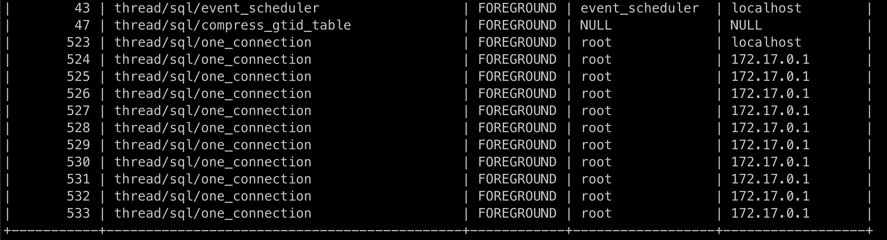
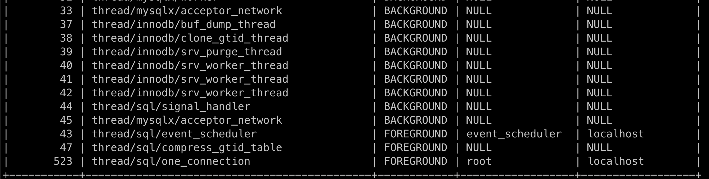

# 아키텍처

## 4.1 MySQL 엔진 아키텍처

### MySQL 엔진

- 클라이언트로부터의 접속 및 쿼리 요청을 처리하는 커넥션 핸들러와 SQL 파서 및 전처리기, 쿼리의 최적화된 실행을 위한 옵티마이저가 중심을 이룸
- 표준 SQL(ANSI SQL) 문법을 지원하기 때문에 표준 문법에 따라 작성된 쿼리는 타 DBMS와 호환되어 실행될 수 있음

### 스토리지 엔진

- 실제 데이터를 디스크 스토리지에 저장하거나 디스크 스토리지로부터 데이터를 읽어오는 역할
- MySQL 엔진은 하나지만 스토리지 엔진은 여러 개를 동시에 사용할 수 있음 (MyISAM - 캐시, InnoDB - 버퍼 풀)

### 핸들러 API

- MySQL 엔진의 쿼리 실행기에서 데이터를 쓰거나 읽어야 할 때 각 스토리지 엔진에 쓰기 또는 읽기 요청함. 이런 요청을 핸들러(Handler)라 한다.

## 4.1.2 MySQL 스레딩 구조

- MySQL 서버는 프로세스 기반이 아니라 스레드 기반으로 작동하며, 크게 포그라운드(Foreground) 스레드와 백그라운드(Background) 스레드로 구분할 수 있음

> SELECT thread_id, name, type, processlist_user, processlist_host FROM performance_schema.threads ORDER BY type, thread_id;

1. 스프링 thread pool로 인한 연결

2. 스프링 종료 후 connection 종료 후

### 포그라운드 스레드 (클라이언트 스레드)

- 최소한 MySQL 서버에 접속된 클라이언트의 수만큼 존재하며, 주로 각 클라이언트 사용자가 요청하는 쿼리 문장을 처리함
- 클라이언트 사용자가 작업을 마치고 커넥션을 종료하면 해당 커넥션을 담당하던 스레드는 다시 스레드 캐시(Thread cache)로 되돌아감
- 이때 이미 스레드 캐시에 일정 개수 이상의 대기 중인 스레드가 있으면 스레드 캐시에 넣지 않고 스레드를 종료시켜 일정 개수의 스레드만 캐시에 존재하게 됨
- 최대 스레드 개수는 thread_cache_size 시스템 변수로 설정
- 포그라운드 스레드는 데이터를 MySQL의 데이터 버퍼나 캐시로부터 가져오며, 버퍼나 캐시에 없는 경우엔 직접 디스크의 데이터나 인덱스 파일로부터 데이터를 읽어와서 작업을 처리함

### 백그라운드 스레드

- InnoDB에서 다음과 같은 작업이 백그라운드로 처리됨
  - 인서트 버퍼(Insert Buffer)를 병합하는 스레드
  - 로그를 디스크로 기록하는 스레드
  - InnoDB 버퍼 풀의 데이터를 디스크에 기록하는 스레드
  - 데이터를 버퍼로 읽어 오는 스레드
  - 잠금이나 데드락을 모니터링하는 스레드

### 메모리 할당 및 사용 구조

- MySQL에 사용되는 메모리 공간은 크게 글로벌 메모리 영역과 로컬 메모리 영역으로 구분 됨
- 글로벌 메모리 영역의 모든 메모리 공간은 MySQL 서버가 시작되면서 운영체제로부터 할당 됨
- 글로벌 메모리 영역과 메모리 영역은 MySQL 서버 내에 존재하는 많은 스레드가 공유해서 사용하는 공간인지 여부에 따라 구분됨
- 글로벌 메모리 영역
  - 클라이언트 스레드 수와 무관하게 하나의 메모리 공간만 할당
  - 필요에 따라 2개 이상 받을 수 있으나 클라이언트 스레드 수완 무관하며, 글로벌 영역이 N개라 해도 모든 스레드에 의해 공유됨
  - 테이블 캐시, InnoDB 버퍼 풀, InnoDB 어댑티브 해시 인덱스, InnoDB 리두 로그 버퍼
- 로컬 메모리 영역
  - 세션 메모리 영역이라고도 하며 MySQL 서버상에 존재하는 클라이언트 스레드가 쿼리를 처리하는데 사용하는 메모리 영역
  - 클라이언트가 서버에 접속하면 서버에서 커넥션으로부터의 요청을 처리하기 위해 스레드 하나씩 할당하게 되는데, 이때 사용되는 영역이라 보면 됨
  - 로컬 메모리기에 스레드별로 독립적으로 할당되며 절대 공유되어 사용되지 않음
  - 정렬 버퍼(Sort buffer), 조인 버퍼, 바이너리 로그 캐시, 네트워크 버퍼

### 쿼리 파서

- 사용자 요청으로 들어온 쿼리 문장을 토큰으로 분리해 트리 형태의 구조로 만들어 내는 작업
- 쿼리 문장의 기본 문법 오류는 이 과정에서 발견되고 사용자에게 오류 메시지 전달

> 토큰: MySQL이 인식할 수 있는 최소 단위의 어휘나 기호

### 전처리기

- 파서 과정에서 만들어진 파서 트리를 기반으로 쿼리 문장에 구조적인 문제점 있는지 확인
- 토큰을 테이블 이름, 칼럼 이름, 또는 내장 함수와 같은 개체를 매핑해 존재 여부, 접근 권한 등을 확인
- 존재하지 않거나 권한상 사용할 수 없는 개체의 토큰은 여기서 걸러짐

### 옵티마이저

- 사용자의 요청으로 들어온 쿼리 문장을 저렴한 비용으로 가장 빠르게 처리할지 결정하는 역할

## 4.2 InnoDB 스토리지 엔진 아키텍처

- MySQL에서 사용할 수 있는 스토리지 엔진 중 거의 유일하게 레코드 기반의 잠금 제공
- 높은 동시성 처리 가능하고 안정적임

### 프라이머리 키에 의한 클러스터링

### 외래 키 지원

- MyISAM이나 MEMORY테이블에선 외래 키를 지원하지 않음

### MVCC(Multi Version Concurrency Control)

- 하나의 레코드에 대해 여러 개의 버전이 동시에 관리됨
- 레코드 레벨의 트랜잭션을 지원하는 DBMS가 제공하는 기능이며, 잠금을 사용하지 않는 일관된 읽기를 제공
- InnoDB는 언두 로그(Undo log)를 이용해서 구현

### 잠금 없는 일관된 읽기(Non-Locking Consistent Read)

- MVCC 기술을 통해 잠금을 걸지 않고 읽기 작업 수행
- 잠금을 걸지 않기 때문에 InnoDB에서 읽기 작업은 다른 트랜잭션이 가지고 있는 잠금을 기다리지 않고, 읽기 작업 가능
- 격리 수준이 SERIALIZABLE이 아닌 레벨들은 다른 트랜잭션 변경 작업과 관계없이 바로 실행 가능하다
- 변경되기 전의 데이터를 읽기 위해선 언두 로그를 사용한다.

> 트랜잭션이 시작됐다면 가능한 한 빨리 롤백이나 커심을 통해 트랜잭션을 완료하라

### 자동 데드락 감지

### 자동화된 장애 복구

### InnoDB 버퍼 풀

- InnoDB 스토리지 엔진에서 가장 핵심적인 부분으로, 디스크의 데이터 파일이나 인덱스 정보를 메모리에 캐시해 두는 공간
- 쓰기 작업을 지연시켜 일괄 작업으로 처리할 수 있게 해주는 버퍼 역할도 함
- 일반적인 APP에서 INSERT, UPDATE, DELETE 같은 데이터 변경 쿼리는 데이터 파일 이곳저곳에 위치한 레코드를 변경하기에 랜덤한 디스크 작업이 발생함.
- 이때 버퍼 풀에 변경된 데이터를 모아 처리하면 랜덤한 디스크 작업의 횟수를 줄일 수 있게 됨