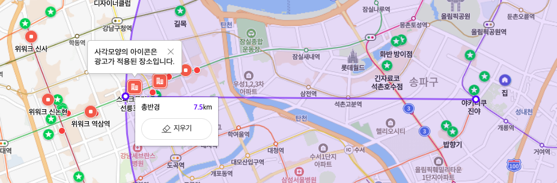

# 1장 근접성 서비스

근접성 서비스는 음식점, 호테르, 극장, 박물관 등 현재 위치에서 가까운 시설을 찾는데 이용됨

## 1단계: 문제 이해 및 설계 범위 한정

### 기능 요구사항

- 사용자의 위치(경도와 위도 쌍)와 검색 반경 정보에 매치되는 사업장 목록을 반환
- 사업장 소유주가 사업장 정보를 추가, 삭제, 갱신할 수 있도록 하되, 그 정보가 검색 결과에 실시간으로 반영될 필요는 없음
- 고객은 사업장의 상세 정보를 살필 수 있어야 함

### 비기능 요구사항(non functional requirements)

- 낮은 응답 지연(latency): 사용자는 주변 사업장을 신속히 검색할 수 있어 함
- 데이터 보호(data privacy): 사용자 위치는 민감
- 고가용성(high availability) 및 규모 확장성(scalability) 요구사항: 인구 밀집 지역에서 이용자가 집중되는 시간에 트래픽이 급증해도 감당할 수 있어야함

### 개략적 규모 측정

- 개략적인 추정 결과 도출 (back-of-the-envelope calculation)
- 일간 능동 사용자(Daily Active User, DAU) 1억명
- 사업장 수 2억개

> QPS(Query Per Second) 계산
> 1일 = 24시간X60분X60초 = 86,400초인데 대략 하루 10^5계산
> 한 사용잦가 보통 5회 검색하면,
> QPS = (1억 사용자 X 5회) / 10^5 = 5,000QPS 성능 필요


docker 설치

```bash
docker run -d --name seokju-post -p 5432:5432 -e POSTGRES_USER=postgres -e POSTGRES_DB=postgis_db -e POSTGRES_PASSWORD=tjrwn12 postgres

docker exec -it seokju-post /bin/bash

psql -U postgres -d postgis_db
```

postgis 설치

CREATE EXTENSION postgis;

> 이 에러가 나오면 아래와 같이 명령어를 쳐주자
> ERROR: extension "postgis" is not available
> DETAIL: Could not open extension control file "/usr/> share/postgresql/15/extension/postgis.control": No such file or directory.
> HINT: The extension must first be installed on the system where PostgreSQL is running.


apt-get update
apt-get install -y 


```sql
insert into business (address, city, state, country, latitude, longitude)
values
    ('강남지점', '서울시', '강남구', '대한민국', 37.496152759494244, 127.02807305796263),
    ('삼성지점', '서울시', '강남구', '대한민국', 37.50768253392469, 127.06040735331399),
    ('역삼지점', '서울시', '강남구', '대한민국', 37.49968740862303, 127.03483711208621),
    ('여의도지점', '서울시', '영등포구', '대한민국', 37.523400096083975, 126.92330130170413),
    ('홍대지점', '서울시', '마포구', '대한민국', 37.55600416632734, 126.92198620013336),
    ('서울스퀘어지점', '서울시', '중구', '대한민국', 37.55548636269725, 126.97348063908571),
    ('을지로지점', '서울시', '중구', '대한민국', 37.56510673783944, 126.98673719961228),
    ('광화문지점', '서울시', '중구', '대한민국', 37.5747192227767, 126.9789245214032),
    ('서면지점', '부산시', '부산진구', '대한민국', 35.157321020308046, 129.06043087886607),
    ('BIFC지점', '부산시', '남구', '대한민국', 35.14814960701628, 129.06531514537028);
```

https://www.movable-type.co.uk/scripts/geohash.html

|지오해시 길이|격자 너비 X 높이|
|----------|------------|
|1|5,009.4km x 4,992.6km(지구 전체)|
|2|1,252.3km x 624.1km|
|3|156.5km x 156km|
|4|39.1km x 19.5km|
|5|4.9km x 4.9km|
|6|1.2km x 609.4m|
|7|152.9m x 152.4m|
|8|38.2m x 19m|
|9|4.8m x 4.8|
|10|1.2m x 59.cm|
|11|14.9cm x 14.9cm|
|12|3.7cm x 1.9cm|

|반경(킬로미터)|지오해시 길이|
|-----------|---------|
|0.5km(0.31마일)|6|
|1km(0.62마일)|5|
|2km(1.24일)|5|
|5km(3.1마일)|4|
|20km(12.42마일)|4|



https://postgis.net/docs/ST_Point.html

https://postgis.net/docs/ST_GeoHash.html