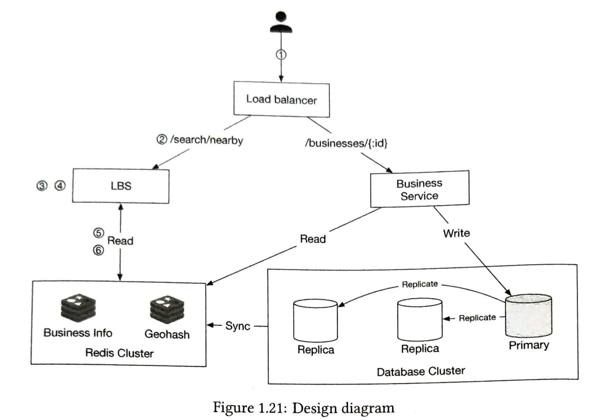
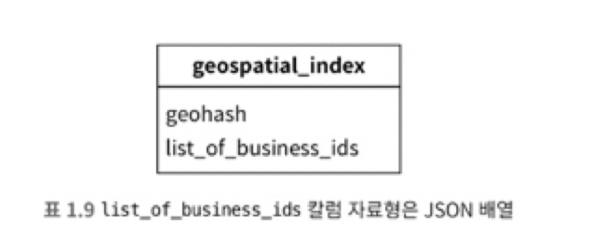
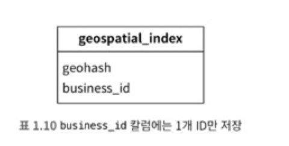

# 1장 근접성 서비스

근접성 서비스는 음식점, 호테르, 극장, 박물관 등 현재 위치에서 가까운 시설을 찾는데 이용됨

## 1단계: 문제 이해 및 설계 범위 한정

### 기능 요구사항

- 사용자의 위치(경도와 위도 쌍)와 검색 반경 정보에 매치되는 사업장 목록을 반환
- 사업장 소유주가 사업장 정보를 추가, 삭제, 갱신할 수 있도록 하되, 그 정보가 검색 결과에 실시간으로 반영될 필요는 없음
- 고객은 사업장의 상세 정보를 살필 수 있어야 함

### 비기능 요구사항(non functional requirements)

- 낮은 응답 지연(latency): 사용자는 주변 사업장을 신속히 검색할 수 있어 함
- 데이터 보호(data privacy): 사용자 위치는 민감
- 고가용성(high availability) 및 규모 확장성(scalability) 요구사항: 인구 밀집 지역에서 이용자가 집중되는 시간에 트래픽이 급증해도 감당할 수 있어야함

### 개략적 규모 측정

- 개략적인 추정 결과 도출 (back-of-the-envelope calculation)
- 일간 능동 사용자(Daily Active User, DAU) 1억명
- 사업장 수 2억개

> QPS(Query Per Second) 계산
> 1일 = 24시간X60분X60초 = 86,400초인데 대략 하루 10^5계산
> 한 사용잦가 보통 5회 검색하면,
> QPS = (1억 사용자 X 5회) / 10^5 = 5,000QPS 성능 필요

## 2단계: 개략젹 설계안 제시 및 동의 구하기



### 로드밸런서 (Load Balancer)

- URL 경로를 분석하여 트래픽을 적절한 서비스로 분배

### LBS (Location-Based Service)

- 주어진 위치와 반경 정보를 이용해 주변 사업장을 검색
- 읽기 요청 중심: 쓰기 요청은 거의 없고, 주로 읽기 요청이 빈번하게 발행
- 높은 QPS: 특히 인구 밀집 지역에서는 트래픽이 급증할 수 있음
- 무상태 서비스: 무상태 서비스이므로 수평적 규모 확장이 용이

### 사업장 서비스

- 사업장 정보 관리: 사업장 소유주가 사업장 정보를 생성, 갱신, 삭제
- 고객 조회: 고객이 사업장 정보를 조회한다.
- 쓰기 요청: 사업장 정보의 생성/갱신/삭제로 인해 쓰기 요청이 발생한다.
- 변동 QPS: QPS는 높지 않지만 특정 시간대에 조회 요청으로 인해 QPS가 높아질 수 있다.

### 데이터베이스 클러스터

- 구성: 주-부 데이터베이스 형태로 구성된다.
  - 주 데이터베이스: 쓰기 요청을 처리한다.
  - 부 데이터베이스: 읽기 요청을 처리한다.
- Replica Lag이 발생할 수 있지만, 사업장 정보가 실시간으로 갱신될 필요가 없기 때문에 큰 문제가 되지 않는다.

> Replica Lag
> 복제 지연은 슬레이브(또는 보조)가 마스터(또는 기본)에서 발생하는 업데이트를 따라잡을 수 없을 때 발생한다. 
> 적용되지 않은 변경 사항은 슬레이브의 릴레이 로그에 누적되며, 슬레이브에 대한 데이터베이스 버전은 마스터와의 차이는 점점 커진다.
> 즉, 슬레이브의 마스터 복제가 지연되는 것이다.

### 사업장 서비스와 LBS의 규모 확장성

- 무상태 서비스: 두 서비스 모두 무상태 서비스이므로 특정 시간대에 스케일아웃하여 대응하고, 유휴 시간대에는 스케일인한다.
- 클라우드 배포: 여러 지역 및 가용성 구역에 서버를 배치하여 확장성과 가용성을 높인다.

## 주변 사업장 검색 알고리즘

### 2차원 검색

- 단순히 x, y 좌표를 기준으로 범위 내의 점들을 검색
- 구현이 간단하지만, 검색 효율이 떨어질 수 있음

### 균등 격자 (Uniform Grid)

- 공간을 균등한 격자로 나누고, 각 격자에 속한 점들을 관리
- 빠른 검색이 가능하지만, 데이터 분포가 고르지 않을 경우 효율이 떨어질 수 있음

### 지오해시 (Geohash)

- 지리적 위치를 문자열로 인코딩하여 검색 및 저장한다.
- 인접한 지역이 유사한 문자열을 가지며, 범위 검색에 효율적이다.
- 아래와 같이 길이에 따른 정밀값을 가짐

|지오해시 길이|격자 너비 X 높이|
|----------|------------|
|1|5,009.4km x 4,992.6km(지구 전체)|
|2|1,252.3km x 624.1km|
|3|156.5km x 156km|
|4|39.1km x 19.5km|
|5|4.9km x 4.9km|
|6|1.2km x 609.4m|
|7|152.9m x 152.4m|
|8|38.2m x 19m|
|9|4.8m x 4.8|
|10|1.2m x 59.cm|
|11|14.9cm x 14.9cm|
|12|3.7cm x 1.9cm|

- 서비스 요구사항으론 반경에 맞는 길이는 아래와 같이 조정할 수 있다.

|반경(킬로미터)|지오해시 길이|
|-----------|---------|
|0.5km(0.31마일)|6|
|1km(0.62마일)|5|
|2km(1.24일)|5|
|5km(3.1마일)|4|
|20km(12.42마일)|4|

### 쿼드트리 (Quadtree):

- 2차원 공간을 재귀적으로 4분할하여 트리 구조로 관리
- 공간 분할을 통해 효율적인 검색 가능
- 메모리상에서 관리

### 구글 S2:

- 지구를 3차원 구체로 간주하고, 이를 2차원 평면에 투영하여 셀로 나눔
- 높은 정밀도로 지리적 위치를 표현하며, 다양한 크기의 셀을 통해 유연한 검색이 가능

## 3단계: 상세 설계
상세 설계 부분에서 고민해볼 수 있는 포인트를 정리해보자.

### 데이터베이스의 규모 확장성

#### 사업장 테이블: 샤딩을 통해서 부하를 고르게 둠

#### 지리 정보 색인 테이블
- 지오해시로 사용했을 땐 방법이 두 가지 있음
- 방안 1: JSON 배열로 저장



  - 각각의 지오해시에 연결되는 모든 사업장 ID를 JSON 배열로 만들어 같은 열에 저장.
  - JSON 배열을 사용하여 한 열에 다수의 사업장 ID 저장.
  - JSON 배열을 읽고, 갱신할 사업장 ID를 찾아내어 갱신. 
  - 새 사업장을 등록할 때 중복 여부 확인을 위해 전체 데이터를 조회. 
  - 병렬 갱신 연산 시 데이터 소실 방지를 위해 락 사용.
  - 장점	
    - 데이터 조회 시 한 번의 읽기로 모든 관련 사업장 ID 확인 가능	
    - 특정 지오해시에 속한 사업장 목록을 쉽게 관리
    - 구조가 간단하여 구현이 쉬움
  - 단점
    - 갱신 시 JSON 배열 전체를 읽고 수정해야 함
    - 새 사업장 추가 시 중복 확인 위해 전체 데이터 조회 필요
    - 	병렬 처리 시 락 사용 필요, 성능 저하 가능

- 방안 2: 별도 열로 저장



  - 같은 지오해시에 속한 사업장 ID 각각을 별도 열로 저장. 
  - 지오해시와 사업장 ID를 각각의 열로 분리하여 저장. 
  - 지오해시와 사업장 ID 컬럼을 합친 복합키 사용. 
  - 사업장 정보 추가/삭제가 용이.
  - 장점
    - 데이터 추가/삭제 시 복합키를 활용하여 효율적으로 처리 가능
    - 병렬 처리에 유리, 락 사용 불필요
    - 확장성과 성능 향상
  - 단점
    - 특정 지오해시에 속한 모든 사업장 ID 조회 시 다수의 읽기 연산 필요
    - 구현 복잡도 증가 가능 
    - 조회 시 각 열을 개별적으로 접근해야 함

> 방안 1: 데이터 조회 빈도가 매우 높고, 갱신 빈도가 낮은 경우.
> 방안 2: 데이터 갱신 및 추가/삭제 빈도가 높고, 병렬 처리 효율성이 중요한 경우.


#### 지리 정보 색인의 규모 확장

- 현재 지리 정보 색인 테이블 구축에 필요한 전체 데이터는 1.71GB의 메모리를 필요로 하여 서버 한 대에 충분히 수용 가능
- 하지만, 읽기 연산의 빈도가 높을 경우 단일 서버의 CPU와 네트워크 대역폭으로 감당하지 못할 수 있다.

- 방안 1: 읽기 연산을 지원할 사본 데이터베이스 서버 늘리기
  - 읽기 연산을 지원하기 위해 여러 사본 데이터베이스 서버를 추가하여 부하를 분산.
  - 개발이 상대적으로 쉽고 관리가 간편.
  - 데이터 일관성 유지가 필요.
  - 장점
    - 개발 및 구현이 상대적으로 쉽다
    - 관리가 간편하다	
    - 수평적 확장이 용이하다
  - 단점
    - 데이터 일관성 유지에 추가적인 노력이 필요
    - 데이터 동기화 지연 발생 가능성
    - 대규모 읽기 트래픽을 처리하는 데 한계가 있을 수 있다
- 방안 2: 샤딩 적용
  - 데이터베이스를 여러 **샤드**로 분할하여 부하를 분산.
  - 샤딩 로직을 애플리케이션 계층에 구현.
  - 관리가 까다로울 수 있음.
  - 필요에 따라 유일한 선택지가 될 수 있음.
  - 장점
    - 데이터 분산으로 읽기 및 쓰기 성능 향상	
    - 대규모 트래픽을 효과적으로 처리 가능	
    - 각 샤드의 부하를 독립적으로 조절 가능
  - 단점
    - 구현 및 관리가 복잡함
    - 샤딩 로직을 애플리케이션 계층에 구현해야 함
    - 데이터 재분할 시 다운타임 발생 가능성

> 방안 1: 시스템의 읽기 트래픽이 중간 수준이고, 데이터 일관성이 상대적으로 중요하지 않은 경우
> 방안 2: 시스템의 읽기 및 쓰기 트래픽이 매우 높고, 성능 최적화가 중요한 경우

#### 지역 및 가용성 구역

- 물리적 거리 최소화
  - 사용자와 시스템 사이의 물리적 거리를 줄여 네트워크 지연 시간을 감소시킴.
- 트래픽 분산
  - 트래픽을 인구 밀집도에 따라 고르게 분산하여 시스템 부하를 효과적으로 관리할 수 있음.
- 사생활 보호법 준수
  - 국가별로 데이터 전송 제한 규정을 준수할 수 있음. 
  - 특정 국가에서 발생하는 트래픽을 해당 국가 내 서비스로 처리하여 법적 규제에 대응.
- 여러 지역과 가용성 구역에 설치했을 때 고려해야 할 점
  - 데이터베이스 간 싱크
    - 여러 지역에 걸친 데이터베이스 간의 데이터 동기화 문제
    - 글로벌 데이터베이스 저장 빈도가 너무 높아 부하가 발생할 수 있으며, 이를 줄이는 작업이 필요

### 최종 설계도 

주변 반경 500미터 내 모든 식당을 찾는 경우 아래와 같이 동작한다.

1. 클라이언트 앱은 사용자의 위치와 검색 반경을 로드밸런서로 전송한다.
2. 로드밸런서는 해당 요청을 LBS로 보낸다. 
3. 주어진 사용자 위치와 반경 정보에 맞춰, LBS는 검색 요건을 만족할 지오해시 길이를 계산한다. (500미터의 경우 지오해시 길이 6)
4. LBS는 인접한 지오해시를 계산한 다음 목록에 추가한다.
5. 목록에 있는 지오해시 각각에 대해 LBS 는 지오해시 레디스 서버를 호출하여 해당 지오해시에 대응하는 모든 사업장 ID를 추출한다.
6. 반환된 사업장 ID들을 가지고 사업장 정보 레디스를 조회하여 각 사업장의 상세정보를 취득한다. 조건에 맞게 필터링 및 소팅 후에 클라이언트 앱에 반환한다.

# 나만의 실습

PostgreSQL과 PostGIS를 활용해서 나름 API대로 구현해보도록 하자

## docker 컨테이너 DB 설치

```bash
docker run -d --name seokju-post -p 5432:5432 -e POSTGRES_USER=postgres -e POSTGRES_DB=postgis_db -e POSTGRES_PASSWORD=tjrwn12 postgres

docker exec -it seokju-post /bin/bash

psql -U postgres -d postgis_db
\l 명령어로 현재 DB 목록 볼 수 있음
```

## postgis 설치

PostgreSQL은 플러그인 형태로 기능을 추가하기에 EXTENSION을 추가해주어야 함

```bash
apt-get update
apt-get install -y

psql -U postgres -d postgis_db # DB접속해서
CREATE EXTENSION postgis; # 플러그인 설치
```

## 데이터 삽입

서울과 부산에 위치한 위워크 사무실의 위/경도와 데이터들 삽입

```sql
insert into business (address, city, state, country, latitude, longitude)
values
    ('강남지점', '서울시', '강남구', '대한민국', 37.496152759494244, 127.02807305796263),
    ('삼성지점', '서울시', '강남구', '대한민국', 37.50768253392469, 127.06040735331399),
    ('역삼지점', '서울시', '강남구', '대한민국', 37.49968740862303, 127.03483711208621),
    ('여의도지점', '서울시', '영등포구', '대한민국', 37.523400096083975, 126.92330130170413),
    ('홍대지점', '서울시', '마포구', '대한민국', 37.55600416632734, 126.92198620013336),
    ('서울스퀘어지점', '서울시', '중구', '대한민국', 37.55548636269725, 126.97348063908571),
    ('을지로지점', '서울시', '중구', '대한민국', 37.56510673783944, 126.98673719961228),
    ('광화문지점', '서울시', '중구', '대한민국', 37.5747192227767, 126.9789245214032),
    ('서면지점', '부산시', '부산진구', '대한민국', 35.157321020308046, 129.06043087886607),
    ('BIFC지점', '부산시', '남구', '대한민국', 35.14814960701628, 129.06531514537028);

-- GEO 관련 함수들 테스트해보기
select
  b.name,
  st_point(b.longitude, b.latitude),
  st_makepoint(b.longitude, b.latitude),
  st_geohash(st_point(b.longitude, b.latitude)),
  ST_DistanceSphere(st_point(b.longitude, b.latitude), st_point(127.12845962603511, 37.502323464512656))
from business b;

select *
from business
where st_dwithin(
              geography(st_setsrid(st_point(longitude, latitude), 4326)),
              geography(st_setsrid(st_point(127.12845962603511, 37.502323464512656), 4326)),
              10000
      );
```

https://www.movable-type.co.uk/scripts/geohash.html


https://postgis.net/docs/ST_Point.html

https://postgis.net/docs/ST_GeoHash.html

## 스프링 코드 작성

### Entity

```java
@Getter
@NoArgsConstructor
@Entity
public class Business {

    @Id
    @GeneratedValue(strategy = GenerationType.IDENTITY)
    public Long id;

    private String name;

    private Address address;

    private Coordinate coordinate;

    public static Business of(CreateUpdateForm createUpdateForm) {
        final Address address = Address.of(
            createUpdateForm.getCountry(),
            createUpdateForm.getCity(),
            createUpdateForm.getState(),
            createUpdateForm.getAddress()
        );

        final Coordinate coordinate = Coordinate.of(
            createUpdateForm.getLatitude(),
            createUpdateForm.getLongitude()
        );

        return new Business(createUpdateForm.getName(), address, coordinate);
    }

    private Business(String name, Address address, Coordinate coordinate) {
        this.name = name;
        this.address = address;
        this.coordinate = coordinate;
    }

    public void modify(CreateUpdateForm createUpdateForm) {
        final String name = createUpdateForm.getName();

        final Address address = Address.of(
            createUpdateForm.getCountry(),
            createUpdateForm.getCity(),
            createUpdateForm.getState(),
            createUpdateForm.getAddress()
        );

        final Coordinate coordinate = Coordinate.of(
            createUpdateForm.getLatitude(),
            createUpdateForm.getLongitude()
        );

        this.name = name;
        this.address = address;
        this.coordinate = coordinate;
    }
}

@Getter
@NoArgsConstructor(access = AccessLevel.PROTECTED)
@Embeddable
public class Address {

    private String country;

    private String city;

    private String state;

    private String address;

    public static Address of(String country, String city, String state, String address) {
        return new Address(country, city, state, address);
    }

    private Address(String country, String city, String state, String address) {
        this.country = country;
        this.city = city;
        this.state = state;
        this.address = address;
    }
}

@Getter
@NoArgsConstructor(access = AccessLevel.PROTECTED)
@Embeddable
public class Coordinate {

    private double latitude;

    private double longitude;

    public static Coordinate of(double latitude, double longitude) {
        return new Coordinate(latitude, longitude);
    }

    private Coordinate(double latitude, double longitude) {
        this.latitude = latitude;
        this.longitude = longitude;
    }
}

```

### controller

```java
@RequiredArgsConstructor
@RestController
public class BusinessController {

    private final BusinessService businessService;

    @GetMapping("/v1/search/nearby")
    public List<Business> getBusinesses(@ModelAttribute SearchRequest searchRequest) {
        return businessService.getAll(searchRequest);
    }

    @GetMapping("/v1/businesses/{id}")
    public Business getBusiness(@PathVariable("id") Long businessId) {
        return businessService.getDetail(businessId);
    }

    @PostMapping("/v1/businesses")
    public Business createBusiness(@RequestBody CreateUpdateForm createUpdateForm) {
        return businessService.create(createUpdateForm);
    }

    @PutMapping("/v1/businesses/{id}")
    public void modifyBusiness(@PathVariable("id") Long businessId, @RequestBody CreateUpdateForm createUpdateForm) {
        businessService.modify(businessId, createUpdateForm);
    }

    @DeleteMapping("/v1/businesses/{id}")
    public void deleteBusiness(@PathVariable(value = "id") Long businessId) {
        businessService.delete(businessId);
    }
}
```

### Service

```java
@Slf4j
@RequiredArgsConstructor
@Transactional(readOnly = true)
@Service
public class BusinessService {

    private final BusinessRepository businessRepository;

    public List<Business> getAll(SearchRequest searchRequest) {
        return businessRepository.findNear(searchRequest.getLatitude(), searchRequest.getLongitude());
    }
    
    public Business getDetail(Long businessId) {
        return businessRepository.findById(businessId)
            .orElseThrow();
    }

    @Transactional
    public Business create(CreateUpdateForm createUpdateForm) {
        final Business business = Business.of(createUpdateForm);
        return businessRepository.save(business);
    }

    @Transactional
    public void modify(Long businessId, CreateUpdateForm createUpdateForm) {
        final Business business = businessRepository.findById(businessId)
            .orElseThrow();

        business.modify(createUpdateForm);
    }

    @Transactional
    public void delete(Long businessId) {
        businessRepository.deleteById(businessId);
    }
}
```

### Repository

```java
public interface BusinessRepository extends JpaRepository<Business, Long> {

    @Query(value = """
            select *
            from business b
            where st_dwithin(
                          geography(st_setsrid(st_point(b.longitude, b.latitude), 4326)),
                          geography(st_setsrid(st_point(:longitude, :latitude), 4326)),
                          10000
                  )
            """, nativeQuery = true)
    List<Business> findNear(@Param("latitude") double latitude, @Param("longitude") double longitude);
}
```

#### 테스트

오금역에서 10키로 이내에 있는 위워크만 출력

GET http://localhost:8080/v1/search/nearby?latitude=37.502323464512656&longitude=127.12845962603511

```json
[
  {
    "id": 1,
    "name": "강남지점",
    "address": {
      "country": "대한민국",
      "city": "서울시",
      "state": "강남구",
      "address": "서초구 강남대로 373 10층"
    },
    "coordinate": {
      "latitude": 37.496152759494244,
      "longitude": 127.02807305796263
    }
  },
  {
    "id": 2,
    "name": "삼성지점",
    "address": {
      "country": "대한민국",
      "city": "서울시",
      "state": "강남구",
      "address": "강남구 테헤란로 518, 10층"
    },
    "coordinate": {
      "latitude": 37.50768253392469,
      "longitude": 127.06040735331399
    }
  },
  {
    "id": 3,
    "name": "역삼지점",
    "address": {
      "country": "대한민국",
      "city": "서울시",
      "state": "강남구",
      "address": "강남구 테헤란로 142, 3층"
    },
    "coordinate": {
      "latitude": 37.49968740862303,
      "longitude": 127.03483711208621
    }
  }
]
```
