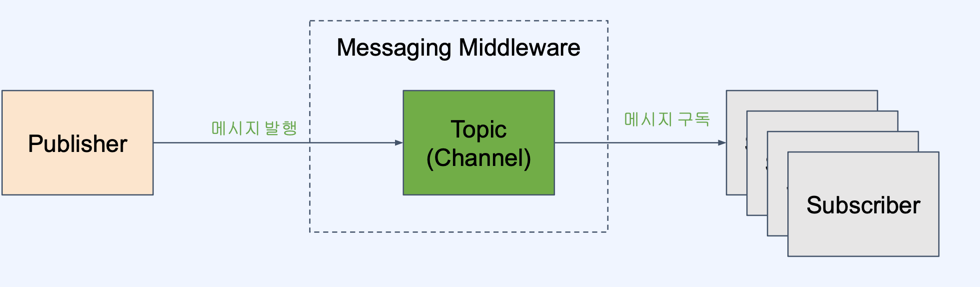
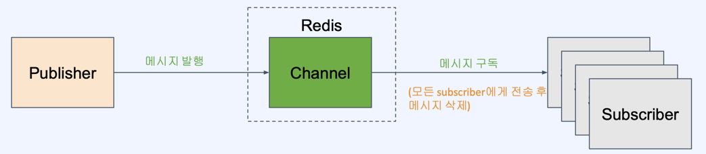

# 2장 주변 친구

## 도입

1장 근접성 서비스와의 차이는 **위치 정보의 정적, 동적 특성이다.**

## 1단계 : 문제 이해 및 설계 범위 설정

1. 지리 데이터의 경우 범위를 제한한다.
2. 거리 계산의 방법을 정의한다. (직선거리, 실제거리)
3. 총 사용자 수, 활성 사용자 수를 정의한다.
4. 데이터 일관성 여부를 확인한다.
5. 서비스의 정책을 확인한다.

### 기능 요구사항

- 모바일 앱 서비스로서 사용자는 주변 친구 목록, 거리, 갱신 시각을 확인할 수 있다.
- 친구 목록 및 이에 따른 지리 데이터는 갱신되어야 한다. (동적 특성)

### 비기능 요구사항

- 낮은 지연 시간 : 잦은 갱신을 필요로 하므로, 낮은 Latency 보장
- 안정성 : 지리 정보의 경우 유실을 허용
- 결과적 일관성 : 갱신 데이터 및 복제를 하므로 어느정도의 비일관성은 허용

## 2단계 : 개략적 설계안 제시 및 동의 구하기

- 개략적 설계 
  - P2P, 공용 벡엔드
  - 로드 밸런서 : RESTful API, 웹소켓 서버의 분리
  - 데이터 베이스
    - 레디스 위치 정보 캐시 , Pub/Sub Server
    - 사용자, 위치 이동 이력 데이터 베이스

### Pub / Sub 패턴

- 메세지 모델 중의 하나로 발행(Publish)과 구독(Subscribe) 역할로 개념화 한 형태
- 발행자와 구독자는 서로에 대한 정보 없이 특정 주제 (토픽 or 채널) 매개로 송수신

- 메세지 미들웨어의 장점
  - 비동기 
  - 낮은 결합도 : Pub - Sub 직접 의존하지 않는다.
  - 예 : Kafka, RabbitMQ ... 

- Redis Pub / Sub 특징

  - 메세지가 큐에 저장되지 않는다.
  - 분산처리 개념이 없다. ( Kafka Consumer Group )
  - 메세지 발행 시 Push 방식으로 Subscriber 전송
  - Subscribe 늘어나면, 성능 저하

- Redis Pub / Sub 유즈 케이스

    - 실시간으로, 빠르게 전송되어야 하는 메시지
    - 메세지 유실 허용되는 경우
    - 데이터 전송 패턴 중, 최대 1회 전송 패턴이 적합한 경우
    - Subscriber 다양성, 유동성 특징을 갖는 경우

  
- API 설계
- 데이터 모델

## 3단계 : 상세 설계

## 4단계 : 마무리

