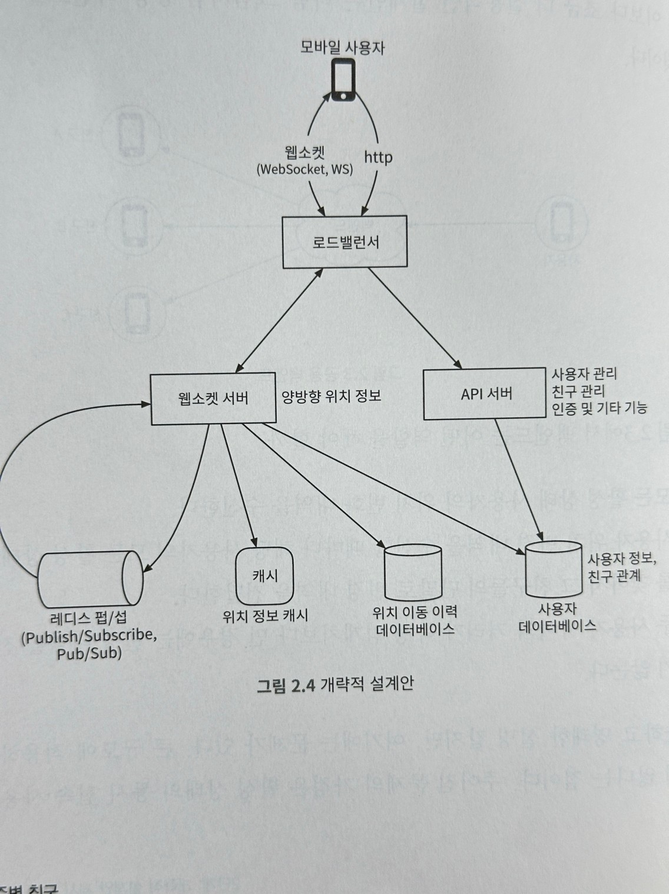
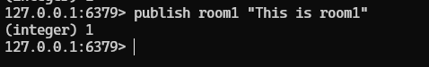
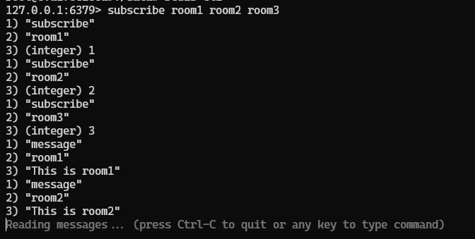
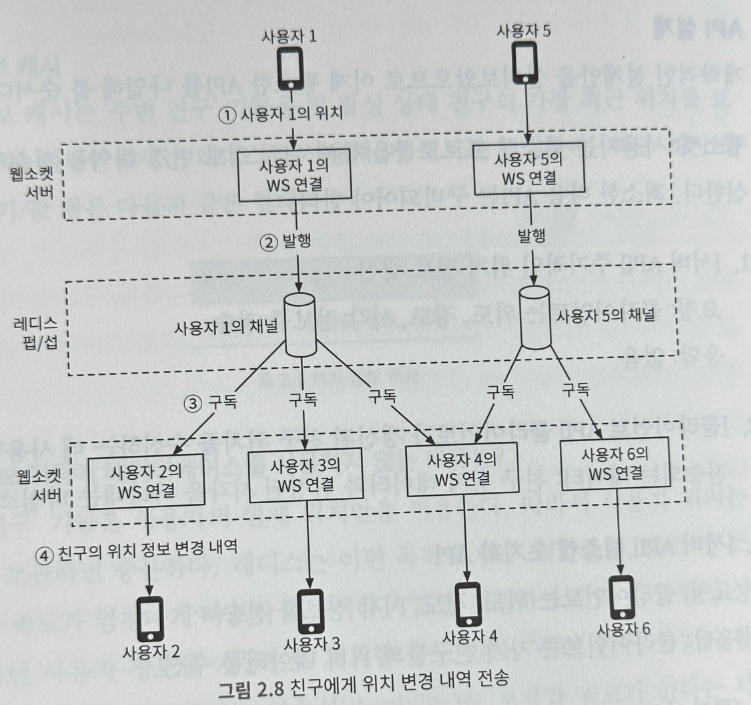

# 2장 주변 친구

## 1단계: 문제 이해 및 설계 범위 확정

### 기능 요구사항

- 모바일 앱에서 주변 친구 확인. 해당 친구까지의 거리, 정보의 마지막 갱신 시각 표시
- 친구 목록은 몇 초마다 한 번씩 갱신

### 비기능 요구사항

- 낮은 지연 시각(low latency): 주변 친구의 위치 변화가 반영되는 데 너무 오랜 시간이 걸리지 않아야 함
- 안정성: 시스템은 전반적으로 안정적이어야 하지만, 몇 개 데이터 유실되는 것은 용인 가능
- 결과적 일관성(eventual consistency): 위치 데이터를 저장하기 위해 강한 일관성(strong consistency)을 지원하는 데이터 저장소를 사용할 필요는 없음.
  - 복제본의 데이터가 원본과 동일하게 변경되기까지 몇 초 정도 걸리는 것은 용인 가능

### 개략적 규모 추정

- 주변 친구 5마일(8km) 이내로 정의
- 친구 위치는 30초 주기로 갱신
  - 걷는 사람의 속도가 시간당 3~4마일. 30초 정도 이동해도 주변 검색 결과가 크게 바뀌지 않음
  - 주변 친구 검색 기능 사용자는 1억 명으로 가정
  - 동시 접속 사용자는 DAU 10%, 천만 명 동시로 가정
  - 평균적으로 한 사용자는 400명의 친구를 갖는다 가정. 그리고 모두 주변 친구 검색 기능을 활용한다 가정
  - 페이지당 20명의 주변 친구를 표시하고, 사용자의 요청이 있으면 더 많은 주변 친구를 보여준다.

> QPS
> 1억 DAU
> 동시 접속 사용자: 10% x 1억 = 천만
> 사용자는 30초마다 자기 위치를 시스템에 전송
> 위치 정보 갱신 QPS = 천만 / 30 =~334,000

## 2단계: 개략적 설계안 제시 및 동의 구하기

### 설계안

### 로드밸런서

- RESTful API 서버 및 양방향 유상태(stateful) 웹소켓 서버 앞단에 위치.
- 부하를 고르게 분사하기 위해 트래픽을 서버들에 배분하는 역할을 함

### RESTful API 서버

- 무상태(stateless) API 서버의 클러스터
- 통상적인 요청/응답 트래픽 처리
- 친구 추가/삭제 및 사용자 정보 갱신 작업 처리

### 웹소켓 서버

- 친구 위치 정보 변경을 거의 실시간에 가깝게 처리하는 유상태 서버 클러스터
- 각 클라이언트는 가운데 소켓 서버와 주기적인 웹소켓 연결을 유지함
- 모바일 클라이언트가 시작되면, 온라인 상태인 모든 주변 친구 위치를 해당 클라이언트로 전송하는 역할을 함

### 레디스 위치 정보 캐시

- 활성 상태 사용자의 가장 최근 위치 정보를 캐시
- TTL(Time-To-Live) 필드를 활용해서 비활성화, 활성화 여부를 따질 수 있음
- 캐시에 보관된 정보를 갱신할 때 TTL도 같이 갱신

### 데이터베이스

- 사용자 데이터베이스: 사용자 데이터 및 사용자의 친구 관계 정보 저장
- 위치 이동 이력 데이터베이스: 위치 변동 이력 저장 (분석용으로 사용)

### 레디스 펍/섭 서버

- 초경량 메시지 버스
- 레디스 펍/섭에 새로운 채널 생성하는 것은 아주 값싼 연산임
- 기가바이트급 메모리를 갖춘 최신 레디스 서버에는 수백만 개의 채널(토픽) 생성 가능
- 웹소켓 서버를 통해 수신한 특정 사용자의 위치 정보 변경 이벤트는 해당 사용자에게 배정된 펍/섭 채널에 발행

### 주기적 위치 갱신

- 모바일 클라이언트는 항구적으로 유지되는 웹소켓을 통해 주기적 위치 변경 내역을 전송
1. 모바일 클라이언트가 위치 변경 내역을 로드밸런서에 전송
2. 로드밸런서는 변경 내역을 클라이언트와 웹소켓 버서 사이에 설정된 연결을 통해 웹소켓 서버로 보냄
3. 웹소켓 서버는 해당 이벤트를 위치 이동 이력 데이터베이스에 저장
4. 웹소켓 서버는 새 위치 정보를 TTL 갱신과 함께 위치 정보 캐시에 저장 + 핸들러 안의 변수에 위치 반영 (거리 계산용)
5. 웹소켓 서버는 레디스 펍/섭 서버의 해당 사용자 채널에 새 위치를 발행함
6. 레디스 펍/섭 채널에 발행된 새로운 위치 변경 이벤트는 모든 구독자에게 브로드캐스트함
7. 메시지를 받은 웹소캣 서버는 새 위치를 보낸 사용자와 메시지를 받은 사용자 사이의 거리를 새로 계산
8. 7에서 계산한 거리가 검색 반경을 넘지 않는다면, 새 위치 및 해당 위치로의 이동이 발생한 시각을 나타내는 타임스탬프를 해당 구독자의 클라이언트 앱으로 전송 (반경이 넘으면 보내지 않음)

#### 레디스 pub/sub 찍먹

1. 사용자 1의 위치가 변경되면 그 변경 내역은 사용자 1과의 연결을 유지하고 있는 웹소켓 서버에 전송됨
2. 해당 변경 내역은 레디스 펍/섭 서버 내의 사용자 1 전용 채널로 발행된다
3. 레디스 펍/섭 서버는 해당 변경 내역을 모든 구독자에게 브로드캐스트함. 이때 구독자는 사용자1과 친구 관계에 있는 모든 웹소켓 연결 핸들러임
4. 위치 변경 내역을 보낸 사용자와 구독자 사이의 거리, 즉 이경우에는 사용자 1과 2 사이의 거리가 검색 반경을 넘지 않을 경우 새로운 위치는 사용자 2의 클라이언트로 전송됨

### API 설계

- 웹소켓: 사용자는 웹소켓 프로토콜을 통해 위치 정보 변경 내역을 전송하고 수신함 아래의 API 구비

- [서버API] 주기적인 위치 정보 갱신
  - 요청: 클라이언트는 위도, 경도, 시각 정보를 전송
  - 응답: 없음
- [클라이언트 API] 클라이언트가 갱신되 친구 위치를 수신하는 데 사용할 API
  - 전송되는 데이터: 친구 위치 데이터와 변경된 시각을 나타내는 타임스탬프
- [서버API] 웹소켓 초기화 API
  - 요청: 클라이언트는 위도, 경도, 시각 정보를 전송
  - 응답: 클라이언트는 자기 친구들의 위치 데이터를 수신
- [클라이언트 API] 새 친구 구독 API
  - 요청: 웹소켓 서버는 친구 ID 전송
  - 응답: 가장 최근의 위도, 경도, 시각 정보 전송
- [클라이언트 API] 구독 해지 API
  - 요청: 웹 소켓 서버는 친구 ID 전송
  - 응답: 없음

- HTTP 요청: API 서버는 친구를 추가/삭제하거나 사용자 정보를 갱신하는 등의 작업을 처리할 수 있어야 함

### 데이터 모델

- 위치 정보 캐시
  - `주변 친구` 기능을 켠 활성 상태 친구의 가장 최근 위치를 보관
  - 레디스를 사용해 캐시 구현

|키|값|
|--|--|
|사용자 ID|{위도, 경도, 시각}|

> 굳이 데이터베이스가 필요 없는 이유는 `현재 위치`를 고속으로 활용하고, TTL 기능을 활용해서 활성/비활성 유저를 분간할 수 있기 때문이다.
> 또한, 영속성을 보장할 필요 없기에 장애가 발생하면 다시 서버를 켜 갱신하기만 하면 됨

- 위치 이동 이력 데이터베이스
  - 수평적 규모 확장 가능한 데이터베이스 필요 (Cassandra)
  - 만약 관계형 DB를 쓰면 샤딩을 활용하면 됨

## 3단계: 상세 설계

### 중요 구성요소별 규모 확장성

- API 서버
  - 무상태로 구성하며, 클러스터를 활용하여 CPU사용률, I/O 상테에 맞춰 자동으로 늘리면 됨
- 웹소켓 서버
  - 유상태 서버이기에 기존 서버 제거시 유의해야 함
  - 노드를 실제 제거하기 전에 로드밸런서가 인식하는 `연결 종료 상태(draining)`으로 변경
  - 모든 연결이 종료되면 서버를 제거
  - 유상태를 서버를 잘 관리하려면 좋은 로드밸런서 필요
- 클라이언트 초기화
  - 모바일 클라이언트는 웹소켓 클러스터 내의 서버 가운데 하나랑 지속성 웹소켓 연결을 맺음
  - 현대적 프로그래밍 언어는 연결 유지에 많은 메모리가 필요하지 않아 괜찮음
  - 웹소켓이 연결 초기화가 이루어지면 클라이언트는 단말 위치 정보를 전송함.
  - 웹소켓 연결 핸들러는 다음 작업을 수행
    - 위치 정보 캐시에 보관된 해당 사용자의 위치 갱신
    - 위치 정보는 계산에 필요하기에 연결 핸들러 내의 변수에 저장
    - 사용자 DB에서 친구 정보 갖고옴
    - 위치 정보 캐시에 일괄(batch) 요청을 보내어 모든 친구 한번에 가져옴 (이때 TTL이 만료된 친구는 보이지 않음)
    - 웹소켓 서버는 캐시가 돌려준 친구 위치를 계산하여 반경 이내면 친구의 상세 정보, 위치, 마지막 확인 시각을 클라이언트에게 반환
    - 웹소켓 서버는 각 친구의 레디스 서버 펍/섭 채널을 구독함 (비용이 저렴하기에 모든 채널 다 만들어두어도 됨)
    - 사용자의 현재 위치를 레디스 펍/섭 서버의 전용 채널을 통해 모든 친구에게 전송
- 사용자 데이터베이스
  - 사용자 정보(프로필, 사용자명 관리)
  - 친구 관계 데이터 관리
- 위치 정보 캐시 (레디스 활용)
  - 활성화된 상태 사용자의 위치 정보를 캐싱
  - TTL을 관리하여 갱신 및 삭제를 진행
- 레디스 펍/섭 서버
  - 모든 온라인 친구에게 메시지 라우팅 역할
  - 채널 만드는 비용이 아주 저렴함 (활성화 전에는 CPU나 I/O를 사용하지 않음)
  - 구독자가 없는 채널의 메시지는 버려지는데 서버에 큰 부하는 없음
  - 이런 방식을 활용하면 메모리가 좀 더 들어도 구조는 단순해짐

#### 주변의 임의 사용자

- 더 나아가 친구 외에 주변 사용자를 무작위로 보여주고 싶은 경우엔 지오해시를 활용
- 지오해시에 따라 구축된 펍/섭 채널 풀을 두어 준비된 격자마다 채널을 만들어둠
- 해당 격자 내의 모든 사용자는 해당 격자에 할당된 채널을 구독함
- 위치가 변경된 사용자가 있으면 변경된 지오해시의 채널로 메시지를 전송해, 이를 받은 구독자들의 화면에서 사용자를 보이게 한다.
