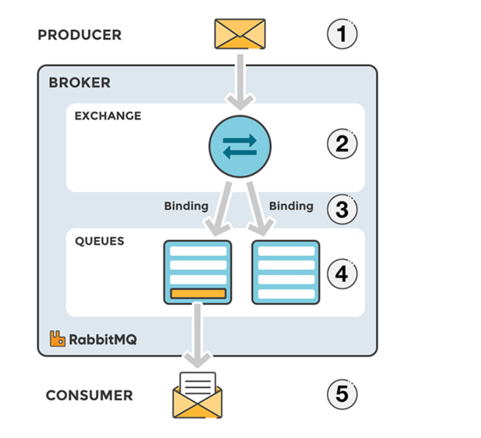
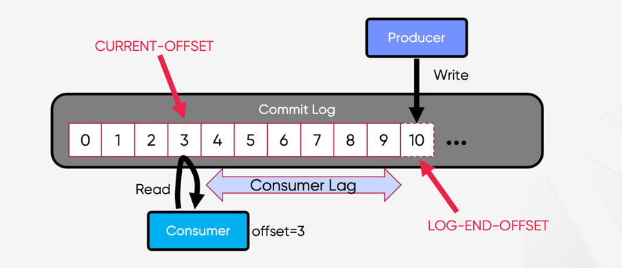
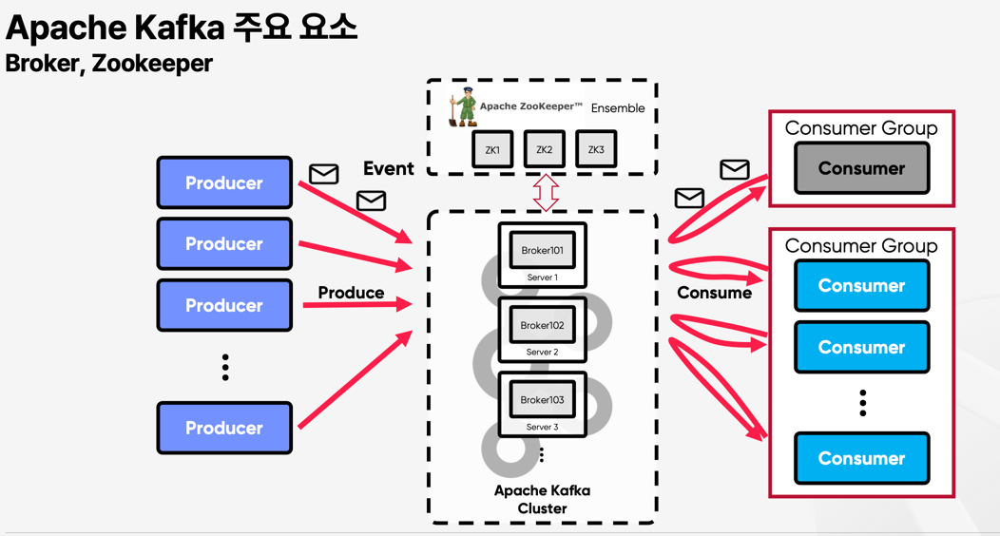
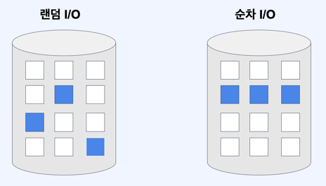

# 분산 메세지 큐

### 메세지 큐를 사용하는 것의 장점

1. 결합도 완화 : 컴포넌트 간의 결합도 낮아진다.
2. 규모 확장성 : 트래픽에 따라 소비자를 유동적으로 조정할 수 있다.
3. 가용성 개선 : 소비자 및 그룹이 장애가 나도 다른 그룹 및 소비자는 영향을 받지 않는다.
4. 성능 개선  : 소비자와 생산자는 비동기 통신이다.

종류 : 카프카, 래빗엠큐...

일반적으로 Rabbit MQ는 `데이터 장기 보관` , `메세지 반복 소비` 제공하지 않는다.

### 토픽, 파티션 브로커

p119. 토픽에 보관되는 데이터의 양이 많아 지면? -> 파티션 즉 샤딩 기법 활용

p119 파티션 내에서의 메세지 위치는 오프셋이라고 한다.

### 소비자 그룹

p 121 문제 : 데이터를 병렬로 읽으면 대역폭 측면에서는 좋지만 같은 파티션 안에 있는 메세지를 순서대로 소비할 수 없다.
-> 해결 :어떤 파티션의 메세지는 한 그룹안에서는 오직 한 소비자만 읽을 수 있도록 제한.

## 3단계 : 상세 설계

메세지 큐의 트래픽 패턴

- 읽기와 쓰기가 빈번하게 발생
- 갱식 / 삭제 연산은 발생하지 않음
- 순차적인 읽기 / 쓰기

데이터 베이스는 대량의 읽기 / 쓰기가 발생하는 트래픽을 처리하기에는 적합하지 않다.

p125. 디스크 성능 관련 유의사항

랜덤 I/O와 순차 I/O
- RDB에서도,랜덤 I/O를 줄인다면...

### 메시지 자료 구조

메세지 구조의 높은 대역폭 달성은 생산자, 메시지 큐, 소비자 사이의 계약을 통해 이루어진다.

생산자가 메세지를 생성하여 메세지 큐를 거쳐 소비자에게 전달되는 과정에서 `불필요한 복사`가 일어나지 않도록.

### 일괄 처리

메세지 큐 안에서의 일괄 처리

- 운영 체제로 하여금 여러 메세지를 한 번의 네트워크 요청으로 전송
- 여러 메세지를 한 번에 로그에 기록하면 더 큰 규모의 순차 쓰기 연산 발생
- 높은 대역폭과 낮은 응답 지연은 공존할 수 없다.
- 응답 지연이 낮추면, 일괄 처리 메시지 양이 줄어든다. -> 파티션 수 증가를 통한 병렬 처리를 높여 벒충한다.

