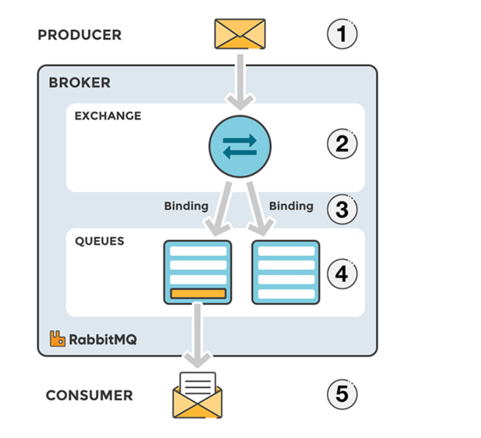
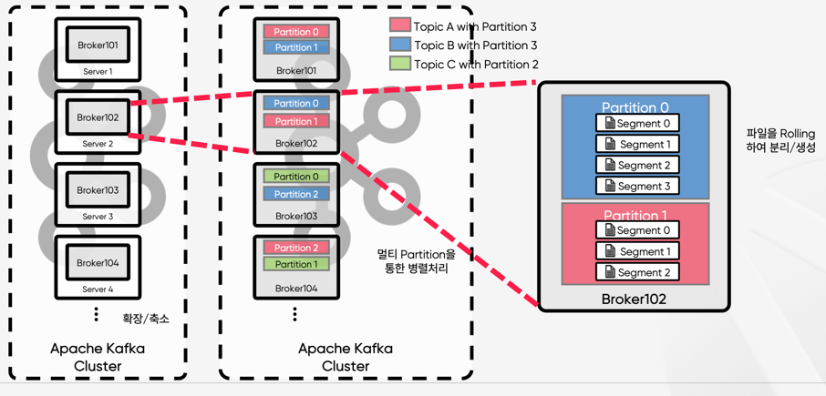
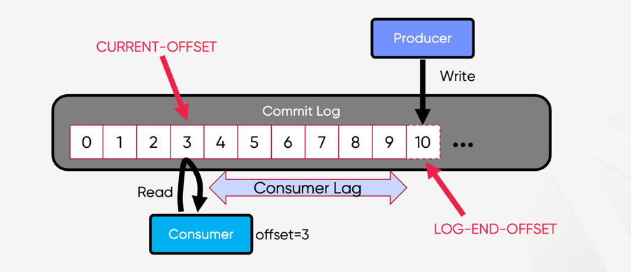

# 분산 메세지 큐

### 메세지 큐를 사용하는 것의 장점

1. 결합도 완화 : 컴포넌트 간의 결합도 낮아진다.
2. 규모 확장성 : 트래픽에 따라 소비자를 유동적으로 조정할 수 있다.
3. 가용성 개선 : 소비자 및 그룹이 장애가 나도 다른 그룹 및 소비자는 영향을 받지 않는다.
4. 성능 개선  : 소비자와 생산자는 비동기 통신이다.

종류 : 카프카, 래빗엠큐...

일반적으로 Rabbit MQ는 `데이터 장기 보관` , `메세지 반복 소비` 제공하지 않는다.

### 토픽, 파티션 브로커

p119. 토픽에 보관되는 데이터의 양이 많아 지면? -> 파티션 즉 샤딩 기법 활용

p119 파티션 내에서의 메세지 위치는 오프셋이라고 한다.
