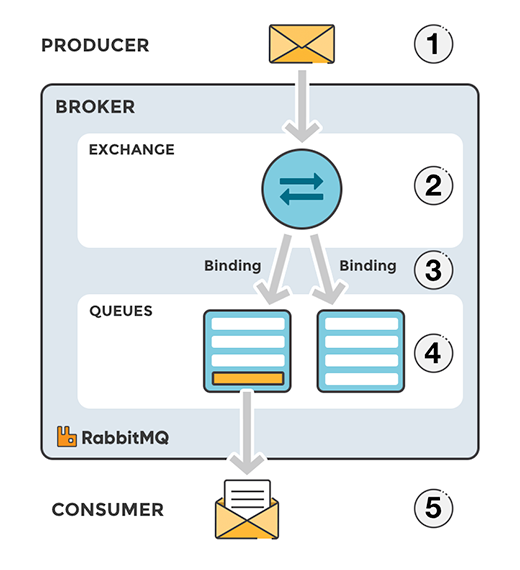
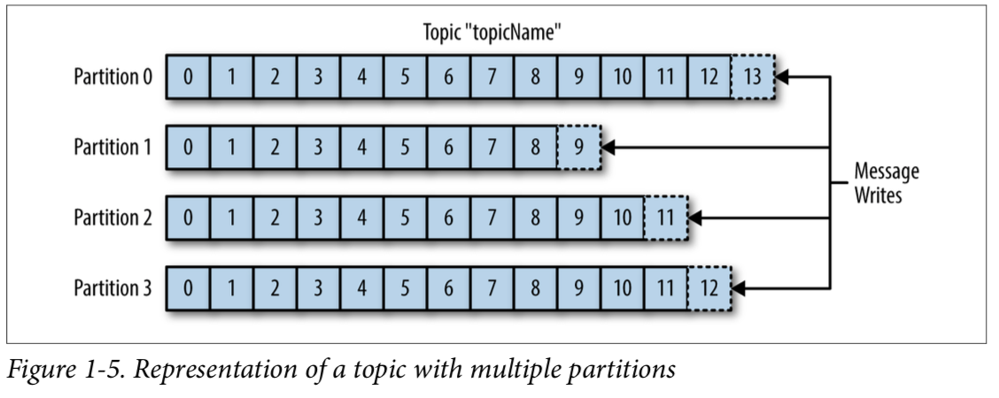
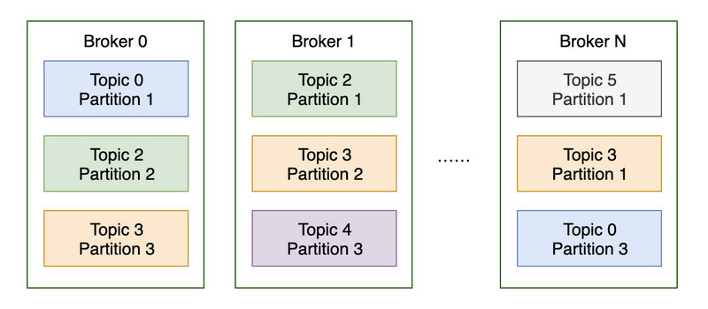
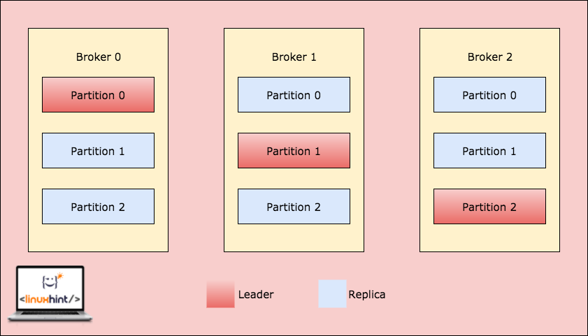

# 4장 분산 메시지 큐

- 현대적 소프트웨어 아키텍처를 따르는 시스템은 잘 정의된 인터페이스를 경계로 나뉜 작고 독립적인 블록들로 구성됨
- 메시지 큐는 이 블록 사이의 통신과 조율을 담당함
- 메시지 큐를 사용하면 아래의 이득을 얻을 수 있음
  - 결합도 완화(decoupling): 메시지 큐를 사용하면 컴포넌트 사이의 강한 결합이 사라지므로 각각을 독립적으로 갱신할 수 있음
  - 규모 확장성 개선:메시지 큐에 데이터를 생산하는 생산자(producer)와 큐에서 메시지를 소비하는 소비자(consumer) 시스템 규모를 트래픽 부하에 맞게 독집적으로 늘릴 수 있음
    - 더 많은 트래픽이 몰리는 시간에 소비자 추가
  - 가용성 개선: 시스템의 특정 컴포넌트에 장애가 발생해도 다른 컴포넌트는 큐와 계속 상호작용할 수 있음
  - 성능 개선: 메시지 큐를 사용하면 비동기 통신이 쉬워짐. 생산자는 응답을 기다리지 않고도 메시지를 보낼 수 있고, 소비자는 읽을 메시지가 있을 때만 메시지 소비하면 됨

> 아파치 카프카, 아파치 RocketMQ, 아파치 RabbitMQ, 아파치 펄사, 아파치 ActiveMQ, ZeroMQ 등이 있음

### 메시지 브로커와 이벤트 스트리밍 플랫폼 차이

> RabbitMQ는 전통적인 메시지 브로커, Kafka는 이벤트 스트리밍 플랫폼

- 메시지 브로커
  - Event Producer가 메세지를 생성하면, 메시지 브로커가 이 메세지를 어떤 큐에 발송할지 결정하는 exchange를 하게 되고, 이렇게 큐에 들어간 메시지는 Event Consumer가 가져가게 됨
  - 따라서 컨슈머가 메시지를 가져가면 큐에서 더 이상 남지 않고 사라지게 됨
  - 메시지 "큐"의 특성에 따라 "선입선출"이 적용되어 메시지는 순서대로 컨슈머에 제공되고, 컨슈머는 미리 정해둔 한계점까지 지속적으로 메시지를 큐에서 읽게됨
  - 이렇게 메시지가 성공적으로 전달되었다 판단되면 큐에서 메세지가 삭제되어 다시 이벤트를 재생하기 어려워짐

- 이벤트 스트리밍 플랫폼
  - 메시지 브로커와 동일하게 이벤트를 수신하고, 소비자에게 전달하는 목적을 갖고 있음
  - topic이라는 event streamer에 저장됨
  - Event Producer가 이벤트를 생성하면, 토픽이라고 불리는 이벤트의 레코드 로그를 streamer에 순서대로 기록함
  - 이후 토픽을 구독(subscribe)한 컨슈머에게 전달하게 됨
  - 토픽을 컨슈머가 가져간 후에도 이벤트 스트림에서 계속 토픽을 유지할 수 있기 때문에 오류 수정이 필요하거나 앱을 리빌드 하는 등의 상황에서 이벤트를 다시 재생시킬 수 있음
  - 즉, 메시지 브로커보다 느슨한 결합을 가지게 되어 격리와 확장이 더 쉬워짐

###  카프카(Apache Kafka) 

- Topics: Kafka에서 특정한 데이터 스트림을 의미
  - 기존 데이터베이스의 테이블과 유사
  - 토픽의 개수는 원하는 만큼 생성 가능
  - 토픽은 이름에 의해 구분됨
  - Topic은 1개 이상의 Partition으로 나뉨 (개수 명시 필요)
- Partitions: 1 토픽은 여러 개의 파티션으로 나뉠 수 있고, 서로 독립적
  - 토픽을 구성하는 파티션은 정렬되어있음
  - 데이터는 유한한 시간 동안 저장(default 일주일)
  - 파티션에 한 번 쓰여진 데이터는 변경 불가능
  - 데이터는 키 값이 제공되지 않으면 파티션에 랜덤하게 할당 됨
  - 각 파티션 속 메시지는 오름차순의 id 값인 Offset을 가지고 있음
- Offsets: 파티션에서 순서를 의미
  - Offset 값이 파티션마다 다를 수 있음
  - 순서는 속해 있는 파티션에서만 보장됨
  - 다른 파티션에서 동일한 Offset이 가리키는 데이터는 같지 않음

### Brokers and Topics

- 카프카 클러스터는 1개 이상의 브로커(서버)로 구성됨
- 각 브로커는 정수형 ID값으로 구분
- 각 브로커는 특정한 토픽의 파티션을 보유
- 브로커끼리 연결하면 클러스터가 됨
- 브로커는 장애 대비 3개 이상을 가지는 것이 좋음
- 토픽을 생성하면 카프카가 자동적으로 파티션들을 브로커에 분배함

### Topic Replication

- 토픽의 정보를 브로커에 분산 처리하게 되면 하나의 브로커에 장애가 발생해도 시스템이 정상적으로 운영되게 하기 위해 다른 브로커에 복사본(replication)을 만드는 것이 안정적임
- 토픽은 복사본의 개수가 1개 보다 커야 좋음 (일반적으로 3개)
- 브로커가 다운되면 다른 브로커가 데이터를 처리해줌
  
---

## 1단계: 문제 이해 및 설계 범위 확정

### 기능 요구 사항

- 생산자는 메시지 큐에 메시지를 보낼 수 있어야 함
- 소비자는 메시지 큐를 통해 메시지를 수신할 수 있어야 함
- 메시지는 반복적으로 수신할 수도 있어야 하고, 단 한 번만 수신하도록 설정될 수 있어야 함
- 오래된 이력 데이터는 삭제될 수 있음
- 메시지 크기는 킬로바이트 수준
- 메시지가 생산된 순서대로 소비자에게 전달할 수 있어야 함
- 메시지 전달 방식은 최소 한 번, 최대 한 번, 정확히 한 번 가운데 설정할 수 있어야 함

### 비기능 요구 사항

- 높은 대역폭과 낮은 전송 지연 가운데 하나를 설정으로 선택 가능하게 하는 기능
- 규모 확장성, 이 시스템은 특성상 분산 시스템일 수밖에 없음. 메시지 양이 급증해도 처리 가능해야 함
- 지속성 및 내구성(persistency and durability): 데이터는 디스크에 지속적으로 보관되어야 하며 여러 노드에 복제되어야 함

## 2단계: 개략적 설계안 제시 및 동의 구하기

