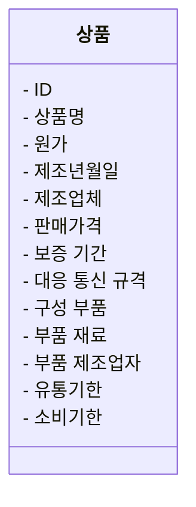
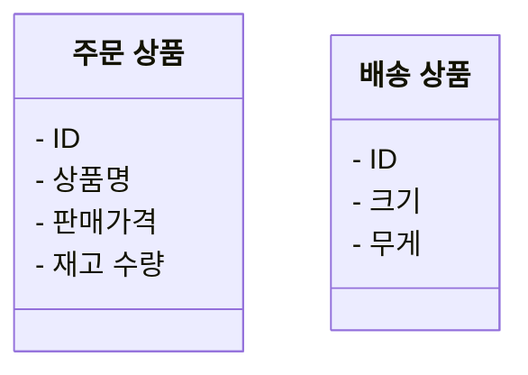

# 13장 모델링: 클래스 설계의 토대

- 모델: 사물의 특징과 관계를 그림으로 나타낸 것
- 모델링: 모델을 만드는 활동

## 13.1 악마를 불러들이기 쉬운 User 클래스

- User 클래스 안에 사용자 정보, 배송지 정보, 법인 등록번호 등을 다 넣으면 문제점이 발생하는 케이스가 많아짐
  - 개인 사용자인데 User.coporationNumber 조회해서 null
  - 법인 사용자인데 User.birthday 조회해서 null
- 이럴때마다 분기를 쳐주게 만들면 유지보수할 때마다 문제가 생기는 코드가 되어버리기 쉬움
- **이를 해결하기 위해선 모델링을 잘해야 한다**

## 13.2 모델링으로 접근해야 하는 구조

- 모델은 시스템의 구조를 설명하기 위해 사용하기에 모델링을 하려면 시스템이 무엇인지 이해해야함
- 모델은 **특정 목적 달성을 위해서 최소한으로 필요한 요소를 갖춘 것**
- 시스템이란
  - 수많은 구성 요소로 이루어진 집합체                                           
  - **각각의 부분이 유기적**으로 연결됨
  - 전체적으로 **하나의 목적**을 갖고 움직임
- 시스템은 목적 달성을 위한 수단
- 모델을 만들 때는 목적에 따라 필요한 요소들만 넣도록 해야함

- 위처럼 다 넣으면 목적을 알기 힘든 거대한 상품 모델이 됨

- 목적별로 정의하여 필요한 값들만 삽입

## 13.3 안 좋은 모델의 문제점과 해결 방법

- User라는 클래스안에 개인정보, 법인정보, 프로필 같은 모든 정보를 다 넣는 것은 `여러 목적에 무리하게 사용되고 있고, 모델링 된 거 같지만 된게 아님`
  - 이를 **관성 없는 모델**이라 함
- 목적별로 모델링 해야함
- 모델은 대상이 아니라 목적 달성의 수단임
- 단일 책임을 통해 단일 목적을 이루도록 해야함
  - 클래스가 이루어야 하는 목적은 반드시 하나야여 한다
  - 클래스는 공통으로 사용가능하고 범용적으로 만드는게 아닌 **특정 목적에 특화하고, 변경하기 쉬운 고품질 구조를 갖게 하는 것이 좋음**
  - 목적을 확립하고 가져야 할 책임들을 만들어 주자

## 13.4 기능성을 좌우하는 모델링

- 기능성: 소프트웨어 품질 특성 중 하나, `고객의 니즈를 만족하는 정도`
- 기능을 제대로 발휘하려면 `개념의 정체`와 `뒤에 숨어 있는 중요한 목적`을 잘 파악해야 함
- 설계는 한 번 했다고 끝나는 것이 아니라, 매일매일 반복해서 개선하는 것이 중요
